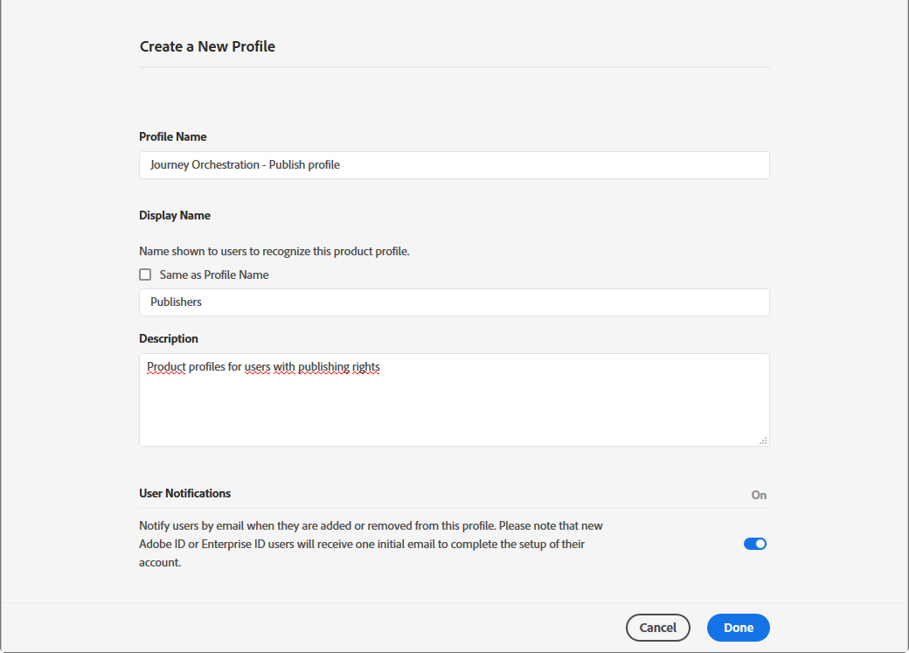
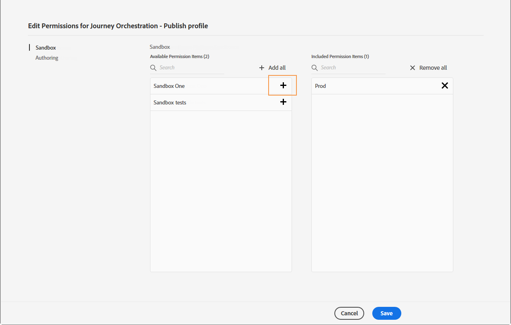
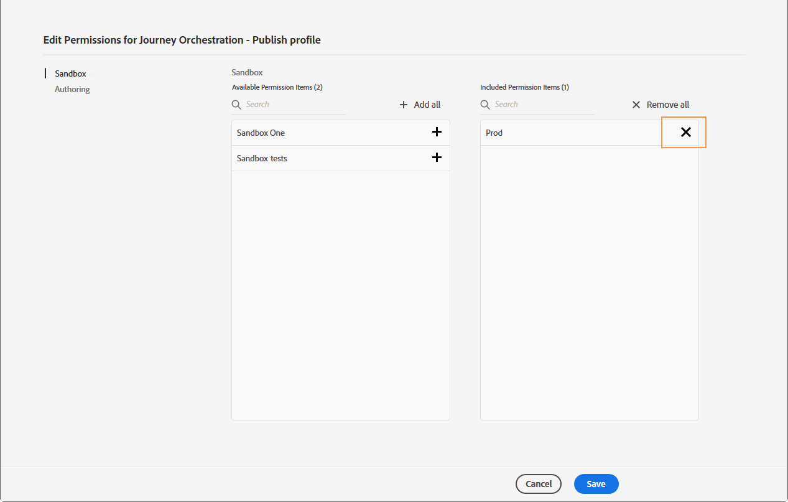
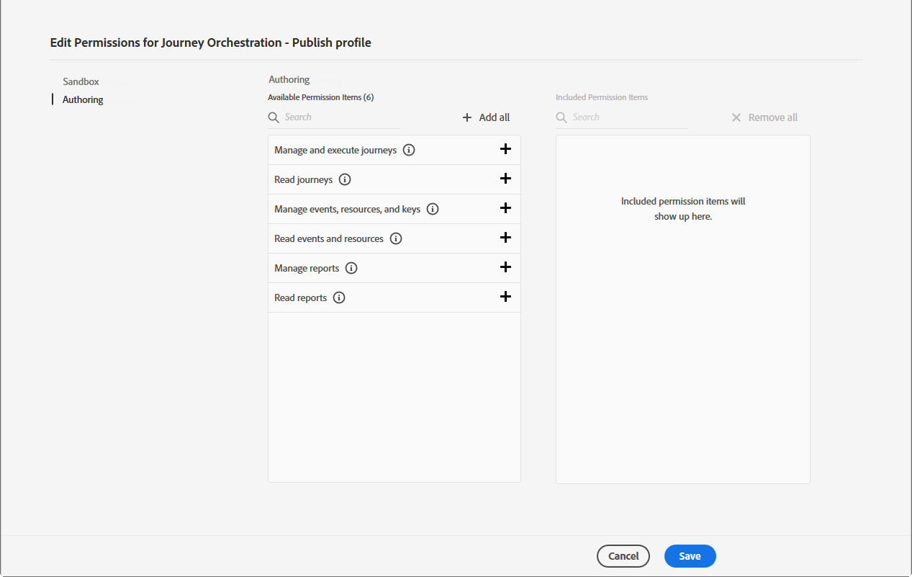

# Åtkomsthantering{#concept_rfj_wpt_52b}

## Om åtkomsthantering {#about-access-management}

[!DNL Journey Orchestration] I kan du tilldela en uppsättning behörigheter till dina användare för att definiera vilken del av gränssnittet de kan komma åt.

De kan hanteras av administratörer som har åtkomst till Admin Console. Mer information om Admin Console finns i den här [dokumentationen](https://helpx.adobe.com/enterprise/managing/user-guide.html).

På Admin Console kan du tilldela användarna en av följande färdiga produktprofiler:

* **[!UICONTROL Limited Access User]**: användare med skrivskyddad åtkomst till resor och rapporter. Den här produktprofilen innehåller följande rättigheter:
   * Läsa resor
   * Läs rapporter

* **[!UICONTROL Administrators]**: användare med tillgång till administrationsmenyerna med möjlighet att hantera resor, evenemang och rapporter. Den här produktprofilen innehåller följande rättigheter:
   * Hantera resor
   * Publicera resor
   * Hantera händelser, datakällor och åtgärder
   * Hantera rapporter
   >[!NOTE]
   >
   >**[!UICONTROL Administrators]** är den enda produktprofil som gör det möjligt att skapa, publicera och publicera transaktionsmeddelanden (eller meddelandemallar) i Adobe Campaign Standard. Den här produktprofilen behövs om du använder Adobe Campaign Standard för att skicka meddelanden på dina resor.

* **[!UICONTROL Standard User]**: användare med grundläggande åtkomst, t.ex. resehantering. Den här produktprofilen innehåller följande rättigheter:
   * Hantera resor
   * Publicera resor
   * Hantera rapporter

Du kan också skapa egna produktprofiler om de färdiga profilerna inte räcker till för att hantera användarna.
Användare måste alltid vara länkade till en produktprofil som gör att du kan tilldela dem specifika inbyggda rättigheter som:

* **[!UICONTROL Read journeys]**
* **[!UICONTROL Read reports]**
* **[!UICONTROL Manage events, data sources and actions]**
* **[!UICONTROL Read events, data sources and actions]**
* **[!UICONTROL Manage journeys]**
* **[!UICONTROL Publish journeys]**
* **[!UICONTROL Manage reports]**

Du hittar kompatibiliteten mellan rättigheter och [!DNL Journey Orchestration]olika funktioner nedan.

## Skapa en produktprofil {#create-product-profile}

[!DNL Journey Orchestration] I kan du skapa egna produktprofiler och tilldela en uppsättning rättigheter och sandlådor till dina användare. Med produktprofiler kan du auktorisera eller neka åtkomst till vissa funktioner eller objekt i gränssnittet.

Mer information om hur du skapar och hanterar sandlådor finns i [Adobe Experience Platform-dokumentationen](https://docs.adobe.com/content/help/en/experience-platform/sandbox/ui/user-guide.html).

Så här skapar du en produktprofil och tilldelar en uppsättning rättigheter och sandlådor:

1. I Admin Console väljer du **[!UICONTROL Journey Orchestration]**. Klicka på **[!UICONTROL New Profile]** på fliken **[!UICONTROL Product profile]**.

   

1. Lägg till en **[!UICONTROL Profile Name]** och **[!UICONTROL Description]** en ny produktprofil. Om du vill att din profil **[!UICONTROL Display name]** ska vara annorlunda avmarkerar du **[!UICONTROL Same as Profile Name]** och skriver in **[!UICONTROL Display name]**.

1. I **[!UICONTROL User Notifications]** kategorin väljer du om användare ska meddelas via e-post när de läggs till eller tas bort från den här produktprofilen.

1. När du är klar klickar du på **[!UICONTROL Done]**. Din nya produktprofil har skapats.

   

1. Välj din nya produktprofil för att börja hantera behörigheter. Lägg till användare i produktprofilen på **[!UICONTROL Users]** fliken. Mer information finns på den här [sidan](../about/access-management.md#assigning-product-profile).

1. Utför samma steg som beskrivs ovan för att lägga **[!UICONTROL Admin]** till i din produktprofil.

1. På **[!UICONTROL Permissions]** fliken väljer du en av de två kategorierna **[!UICONTROL Sandbox]** eller **[!UICONTROL Authoring]** för att öppna **[!UICONTROL Edit Permissions]** sidan och lägga till eller ta bort behörigheter för produktprofilen.

   

1. I behörighetskategorin väljer du vilken eller vilka sandlådor som ska tilldelas till din produktprofil. **[!UICONTROL Sandbox]** Under **[!UICONTROL Available Permissions Items]** klickar du på plusikonen (+) för att tilldela sandlådor till din profil. Mer information om sandlådor finns i det här [avsnittet](../about/access-management.md#sandboxes).

   

1. Om det behövs klickar du under **[!UICONTROL Included Permission Items]** X-ikonen bredvid Ta bort behörigheter till din produktprofil.

   

1. Gå till behörighetskategorin och utför samma steg som ovan för att lägga till rättigheter till din produktprofil. **[!UICONTROL Authoring]**
    Mer information om rättigheter och kompatibilitet mellan rättigheter och [!DNL Journey Orchestration]olika funktioner finns i det här [avsnittet](../about/access-management.md#about-access-management).

   

1. När du är klar klickar du på **[!UICONTROL Save]**.

Din produktprofil har nu skapats och konfigurerats. Användare som är länkade till den här profilen kan nu ansluta till [!DNL Journey Orchestration].

## Tilldela en produktprofil {#assigning-product-profile}

Produktprofiler tilldelas till en uppsättning användare som delar samma rättigheter inom organisationen.
I det här avsnittet finns en lista med alla produktprofiler som inte är installerade på datorn och som har tilldelats rättigheter.

Så här tilldelar du en produktprofil åt en användare [!DNL Journey Orchestration]:

1. I Admin Console väljer du **[!UICONTROL Journey Orchestration]**.

   

1. Välj den produktprofil som den nya användaren ska länkas till.

   

1. Klicka på **[!UICONTROL Add user]**.

   Du kan också lägga till din nya användare i en användargrupp för att finjustera den delade behörighetsgruppen. Mer information finns på den här [sidan](https://helpx.adobe.com/enterprise/using/user-groups.html).

   

1. Skriv den nya användarens e-postadress och klicka sedan på **[!UICONTROL Save]**.

   

Användaren bör sedan få ett e-postmeddelande som omdirigeras till din [!DNL Journey Orchestration] instans.

## Använda sandlådor {#sandboxes}

[!DNL Journey Orchestration] I kan du partitionera instansen i separerade virtuella miljöer, så kallade sandlådor.
Sandlådor tilldelas via produktprofiler i Admin Console. Mer information om hur du tilldelar sandlådor finns i det här [avsnittet](../about/access-management.md#create-product-profile).

[!DNL Journey Orchestration] speglar de Platform-sandlådor som har skapats för en viss organisation.
Platform-sandlådor kan skapas eller återställas från din Adobe Experience Platform-instans. Detaljerade anvisningar finns i användarhandboken [för](https://docs.adobe.com/content/help/en/experience-platform/sandbox/ui/user-guide.html) Sandbox.

Du hittar kontrollen för sandlådeväljaren längst upp till vänster på skärmen. Om du vill växla från en sandlåda till en annan klickar du på den för närvarande aktiva sandlådan i växlaren och väljer en annan sandlåda i listrutan.
