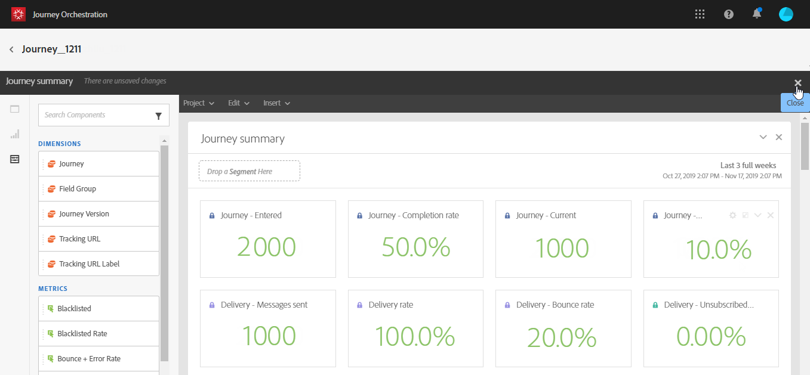

# Kom igång{#concept_y4b_4qt_52b}

I [!DNL Journey Orchestration]finns det två typer av användare som utför olika uppgifter: den **tekniska användaren** och **affärsanvändaren**. Användaråtkomst hanteras via produktprofiler och rättigheter. Mer information  om hur du konfigurerar användaråtkomst finns i.

Här följer de viktigaste stegen för att konfigurera och använda [!DNL Journey Orchestration]:

1. **Konfigurera en händelse**

   Du måste definiera den förväntade informationen och hur den ska behandlas. Den här konfigurationen är obligatorisk. Det här steget utförs av en **teknisk användare**.

   For more on this, refer to .

   

1. **Konfigurera datakällan**

   Du måste definiera en anslutning till ett system för att hämta ytterligare information som ska användas i dina resor, till exempel under dina förhållanden. En inbyggd Adobe Experience Platform-datakälla konfigureras också vid etablering. Det här steget är inte nödvändigt om du bara utnyttjar data från händelserna under din resa. Det här steget utförs av en **teknisk användare**.

   For more on this, refer to .

   

1. **Konfigurera en åtgärd**

   Om du använder ett tredjepartssystem för att skicka meddelanden måste du konfigurera anslutningen till det [!DNL Journey Orchestration]. Se .

   Om du använder Adobe Campaign Standard för att skicka meddelanden måste du konfigurera den inbyggda åtgärden. Se .

   Dessa steg utförs av en **teknisk användare**.

   

1. **Designa din resa**

   Kombinera de olika händelserna, samordningen och åtgärderna för att skapa flerstegsscenarier för olika kanaler. Det här steget utförs av en **företagsanvändare**.

   Mer information finns i .

   

1. **Testa och publicera resan**

   Ni måste validera och aktivera resan. Det här steget utförs av en **företagsanvändare**.

   Mer information finns i  och .

   

1. **Övervaka din resa**

   Använd de dedikerade rapportverktygen för att mäta hur effektiv din resa är. Det här steget utförs av en **företagsanvändare**.

   Mer information finns i .

   

