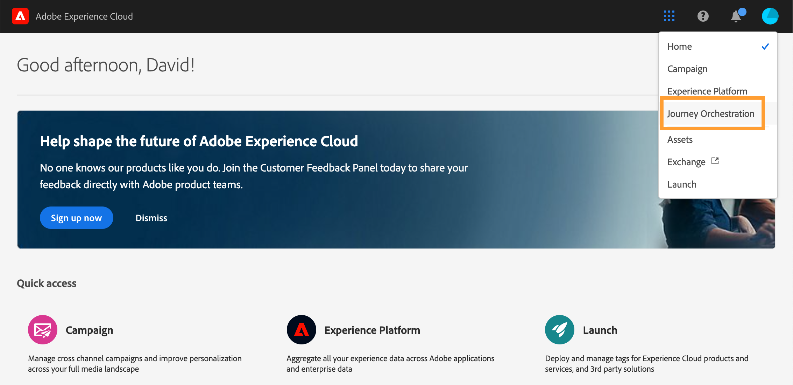

# Användargränssnitt{#concept_rcq_lqt_52b}

>[!NOTE]
>
>För att du ska få ut så mycket som möjligt av [!DNL Journey Orchestration] rekommenderar vi att du använder webbläsaren Chrome. Gränssnittet visas på det språk som definieras i IMS. Om ditt IMS-språk inte stöds av [!DNL Journey Orchestration] visas gränssnittet på engelska.
>
>Dokumentationen uppdateras ofta för att återspegla de senaste ändringarna i produkten. Vissa skärmbilder kan dock skilja sig något från produktens gränssnitt.

## Komma åt [!DNL Journey Orchestration]{#accessing_journey_orchestration}

Om du vill komma åt gränssnittet för [!DNL Journey Orchestration] klickar du på ikonen **[!UICONTROL App Selector]** längst upp till höger och sedan på **[!UICONTROL Journey Orchestration]**.

Du kan även komma åt [!DNL Journey Orchestration] från webbplatsen för Experience Cloud i avsnittet **[!UICONTROL Quick access]**.

## Lära känna gränssnittet{#section_jsq_zr1_ffb}

>[!CONTEXTUALHELP]
>id="jo_home"
>title="Om reselistan"
>abstract="Med reselistan kan du se alla dina resor på en gång, se deras status och utföra grundläggande åtgärder. Du kan skapa dubbletter, stoppa eller radera dina resor. Beroende på resan kanske vissa åtgärder inte är tillgängliga. Du kan till exempel inte radera eller starta om en resa som är stängd. Du kan skapa en ny version av den eller skapa en dubblett. Du kan också använda sökfältet för att söka efter en resa."
>additional-url="https://images-tv.adobe.com/mpcv3/38af62cb-9390-4bc0-a576-d336849adb97_1574809570.1920x1080at3000_h264.mp4" text="Se demovideon"

Med de översta menyerna kan du navigera bland de olika funktionerna i [!DNL Journey Orchestration]: **[!UICONTROL Home]** (resorna), **[!UICONTROL Data Sources]**, **[!UICONTROL Events]**, **[!UICONTROL Actions]**.

Klicka på -ikonen på skärmens övre högra hörn för att visa sammanhangsberoende hjälp. Den finns för alla listskärmar i [!DNL Journey Orchestration] (resor, händelser, åtgärder och datakällor). Hjälpen innehåller en kort beskrivning av den aktuella funktionen och du får tillgång till relaterade artiklar och videor.

## Söka och filtrera{#section_lgm_hpz_pgb}

I listorna **[!UICONTROL Home]**, **[!UICONTROL Data Sources]**, **[!UICONTROL Events]** och **[!UICONTROL Actions]** kan du söka efter ett alternativ med hjälp av ett sökfält.

Du kommer åt **[!UICONTROL Filters]** genom att klicka på filterikonen högst upp till vänster i listan. Med filtermenyn kan du filtrera de element som visas enligt olika villkor. Du kan välja att endast visa element av en viss typ eller status, de som du har skapat eller de som har ändrats under de senaste 30 dagarna.

I listorna **[!UICONTROL Data Sources]**, **[!UICONTROL Events]** och **[!UICONTROL Actions]** kan du använda **[!UICONTROL Creation filters]** för att filtrera per datum för skapande och per användare. Du kan till exempel välja att bara visa händelser som du har skapat under de senaste 30 dagarna.

I reselistan (under **[!UICONTROL Home]**) kan du utöver **[!UICONTROL Creation filters]** filtrera de visade resorna per status och version (**[!UICONTROL Status and version filters]**). Du kan även välja att endast visa resor som använder en viss händelse, fältgrupp eller åtgärd (**[!UICONTROL Activity filters]** och **[!UICONTROL Data filters]**). Med **[!UICONTROL Publication filters]** kan du välja ett publiceringsdatum eller en viss användare. Du kan till exempel välja att endast visa de senaste versionerna av resor i realtid som publicerades i går. Läs [den här sidan](../building-journeys/using-the-journey-designer.md).

>[!NOTE]
>
>Observera att kolumner som visas kan personaliseras med hjälp av konfigurationsknappen längst upp till höger i listorna. Personalisering sparas per användare.

Med kolumnerna **[!UICONTROL Last update]** och **[!UICONTROL Last update by]** kan du visa när den senaste uppdateringen av dina resor gjorts och vilken användare som använde den.

I konfigurationsfönstren för händelser, datakällor och åtgärder visar fältet **[!UICONTROL Used in]** antalet resor som använder just den händelsen, fältgruppen eller åtgärden. Du kan klicka på knappen **[!UICONTROL View journeys]** för att visa en lista över motsvarande resor.

I de olika listorna kan du utföra grundläggande åtgärder för varje element. Du kan till exempel skapa dubbletter eller radera en post.

## Bläddra bland datafälten i Adobe Experience Platform {#friendly-names-display}

När du definierar [händelsers nyttolast](../event/defining-the-payload-fields.md), [fältgruppers nyttolast](../datasource/field-groups.md) och väljer fält i [uttrycksredigeraren](../expression/expressionadvanced.md) visas visningsnamnet förutom fältnamnet. Den här informationen hämtas från schemadefinitionen i upplevelsedatamodellen.

Om beskrivningar som &quot;xdm:alternateDisplayInfo&quot; anges när du ställer in scheman, ersätts visningsnamnen med de användarvänliga namnen. Detta är särskilt användbart när du arbetar med &quot;eVars&quot; och generiska fält. Du kan konfigurera användarvänliga namnbeskrivningar via ett API-anrop. Mer information finns i [utvecklarhandboken för schemaregister](https://docs.adobe.com/content/help/sv-SE/experience-platform/xdm/api/getting-started.html).

Om användarvänliga namn finns visas fältet som `<friendly-name>(<name>)`. Om det inte finns något användarvänligt namn visas till exempel visningsnamnet som `<display-name>(<name>)`. Om inget av dem är definierade visas bara fältets tekniska namn `<name>`.

>[!NOTE]
>
>Användarvänliga namn hämtas inte när du väljer fält från en sammanslutning av scheman.

## Använda olika kortkommandon{#section_ksq_zr1_ffb}

Här är de olika kortkommandona som finns i gränssnittet i [!DNL Journey Orchestration].

_I listan över resor, åtgärder, datakällor eller händelser:_

* Tryck på **c** för att skapa en ny resa, åtgärd, datakälla eller händelse.

_När du konfigurerar en aktivitet i en resa:_

Arbetsytan sparas automatiskt. Sparstatus visas längst upp till vänster på arbetsytan.

* Tryck på **Esc** för att stänga konfigurationsfönstret och ignorera ändringarna. Det här är motsvarigheten till knappen **[!UICONTROL Cancel]**.
* Tryck på **Enter** eller klicka utanför fönstret för att stänga konfigurationsfönstret. Ändringarna sparas. Det här är motsvarigheten till knappen **[!UICONTROL Ok]**.
* Om du trycker på **Delete** eller på **Backsteg** kan du sedan trycka på **Enter** för att bekräfta borttagningen.

_I popup-fönster:_

* Tryck på **Esc** för att stänga fönstret (motsvarar knappen **[!UICONTROL Cancel]**).
* Tryck på **Enter** för att spara eller bekräfta (motsvarar knappen **[!UICONTROL Ok]** eller **[!UICONTROL Save]**).

_I konfigurationsfönstret för händelser, datakällor eller åtgärder:_

* Tryck på **Esc** för att stänga konfigurationsfönstret utan att spara.
* Tryck på **Enter** för att spara ändringarna och stänga konfigurationsfönstret.
* Tryck på **Tabb** för att hoppa mellan de olika fälten som ska konfigureras.

_I den enkla uttrycksredigeraren:_

* Dubbelklicka på ett fält till vänster för att lägga till en fråga (motsvarande dra och släpp).

_När du bläddrar bland XDM-fält:_

* Om du markerar en &quot;nod&quot; markeras alla fält i noden.

_I alla textområden:_

* Markera texten med tangentkombinationen **Ctrl/Kommando+A**. I nyttolastens förhandsvisning väljs nyttolasten.

_På en skärm med ett sökfält:_

* Markera sökfältet med tangentkombinationen **Ctrl/Kommando+F**.

_På resans arbetsyta:_

* Markera alla aktiviteter med tangentkombinationen **Ctrl/Kommando+A**.
* Tryck på **Delete** eller på **Backsteg** för att radera en eller flera aktiviteter som är markerade. Därefter kan du trycka på **Enter** för att bekräfta i popup-fönstret.
* Dubbelklicka på en aktivitet från den vänstra paletten för att lägga till den på den första tillgängliga positionen (uppifrån och ned).

_Under en resa:_

* Tryck på **T** för att aktivera/inaktivera testläget.
* I en händelsebaserad resa i testläge trycker du på **E** för att aktivera en händelse.
* Om alternativet **Enskild profil i taget** är markerat i testläge i en segmentbaserad resa trycker du på **P** för att aktivera en händelse.
* I testläge trycker du på **L** för att visa loggarna.

