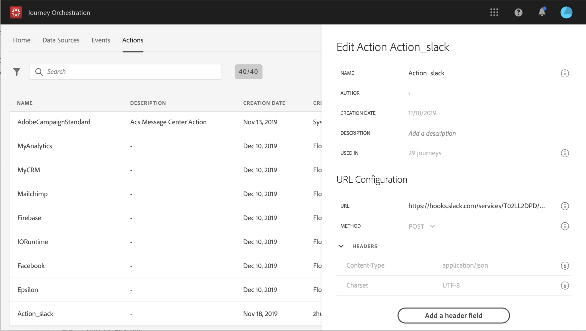

# URL-konfiguration {#concept_gbg_1f1_2gb}

När du konfigurerar en anpassad åtgärd måste du definiera följande **[!UICONTROL URL Configuration]** parametrar:

1. Lägg till den externa **[!UICONTROL URL]** tjänstens namn.

   >[!NOTE]
   >
   >Vi rekommenderar starkt att du använder HTTPS av säkerhetsskäl. Vi tillåter inte användning av Adobe-adresser som inte är offentliga och användning av IP-adresser.

1. Välj samtalet **[!UICONTROL Method]**: det kan vara antingen **[!UICONTROL POST]** eller **[!UICONTROL PUT]**.
1. I **[!UICONTROL Headers]** avsnittet klickar du **[!UICONTROL Add a header field]** för att definiera ett nytt nyckel/värde-par. De motsvarar HTTP-rubrikerna för den begäran som görs till den externa tjänsten. Om du vill ta bort par med nyckel/värde placerar du markören i **[!UICONTROL Headers]** fältet och klickar på **[!UICONTROL Delete]** ikonen.

   **[!UICONTROL Content-Type]** och **[!UICONTROL Charset]** anges som standard och kan inte tas bort eller åsidosättas.

   >[!NOTE]
   >
   >Sidhuvuden valideras enligt följande [tolkningsregler](https://tools.ietf.org/html/rfc7230#section-3.2.4).
