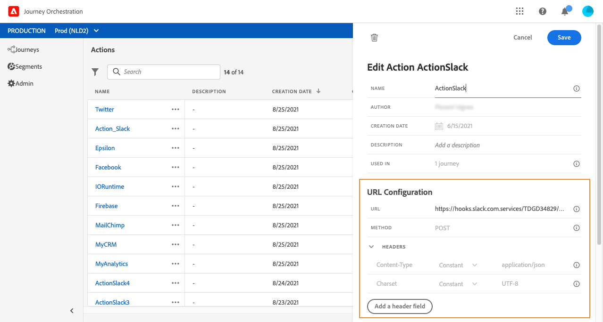

# URL-konfiguration {#concept_gbg_1f1_2gb}

>[!CAUTION]
>
>**Söker du Adobe Journey Optimizer**? Klicka [här](https://experienceleague.adobe.com/en/docs/journey-optimizer/using/ajo-home){target="_blank"} för Journey Optimizer-dokumentation.
>
>
>_Den här dokumentationen hänvisar till äldre Journey Orchestration-material som har ersatts av Journey Optimizer. Kontakta ditt kontoteam om du har frågor om din åtkomst till Journey Orchestration eller Journey Optimizer._

När du konfigurerar en anpassad åtgärd måste du definiera följande **[!UICONTROL URL Configuration]**-parametrar:

1. Ange URL-adressen för den externa tjänsten i fältet **[!UICONTROL URL]**:

   * Om URL:en är statisk anger du URL:en i det här fältet.

   * Om URL:en innehåller en dynamisk sökväg anger du bara den statiska delen av URL:en, det vill säga schemat, värden, porten och, eventuellt, en statisk del av sökvägen.

     Exempel: `https://xxx.yyy.com/somethingstatic/`

     Du anger den dynamiska sökvägen för URL:en när du lägger till den anpassade åtgärden på en resa. [Läs mer](../building-journeys/using-custom-actions.md).

   >[!NOTE]
   >
   >Av säkerhetsskäl rekommenderar vi starkt att du använder HTTPS-schemat för URL:en. Vi tillåter inte användning av Adobe-adresser som inte är offentliga och användning av IP-adresser.
   >
   >Endast standardportar tillåts när en anpassad åtgärd definieras: 80 för http och 443 för https.

1. Välj anropet **[!UICONTROL Method]**: det kan vara antingen **[!UICONTROL POST]** eller **[!UICONTROL PUT]**.
1. I avsnittet **[!UICONTROL Headers]** definierar du HTTP-huvudena för det begärandemeddelande som ska skickas till den externa tjänsten:
   1. Klicka på **[!UICONTROL Add a header field]** om du vill lägga till ett rubrikfält.
   1. Ange huvudfältets nyckel.
   1. Om du vill ange ett dynamiskt värde för nyckelvärdepar väljer du **[!UICONTROL Variable]**. Annars väljer du **[!UICONTROL Constant]**.

      Du kan till exempel ange ett dynamiskt värde för en tidsstämpel.

   1. Om du har markerat **[!UICONTROL Constant]** anger du konstantvärdet.

      Om du har valt **[!UICONTROL Variable]** anger du den här variabeln när du lägger till den anpassade åtgärden på en resa. [Läs mer](../building-journeys/using-custom-actions.md).

      

   1. Om du vill ta bort ett rubrikfält pekar du på rubrikfältet och klickar på ikonen **[!UICONTROL Delete]**.

   Rubrikfälten **[!UICONTROL Content-Type]** och **[!UICONTROL Charset]** anges som standard. Du kan inte ändra eller ta bort dessa fält.

   När du har lagt till den anpassade åtgärden för en resa kan du fortfarande lägga till rubrikfält i den om resan är i utkaststatus. Om du inte vill att resan ska påverkas av konfigurationsändringar duplicerar du den anpassade åtgärden och lägger till rubrikfälten i den nya anpassade åtgärden.

   >[!NOTE]
   >
   >Huvuden valideras enligt fälttolkningsregler. [Läs mer](https://tools.ietf.org/html/rfc7230#section-3.2.4).
