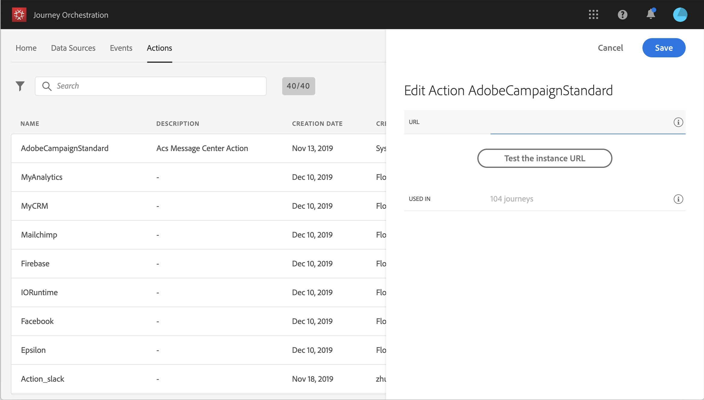

# Arbeta med Adobe Campaign  {#using_adobe_campaign_standard}

Du kan skicka e-post, push-meddelanden och SMS med Adobe Campaign Standard Transactional Messaging-funktioner.

[!DNL Journey Orchestration] levereras med en körklar åtgärd som tillåter anslutning till Adobe Campaign Standard.

Campaign Standardens transaktionsmeddelande och tillhörande händelse måste publiceras för att kunna användas i Journey Orchestration. Om händelsen publiceras men meddelandet inte visas visas den inte i Journey Orchestration-gränssnittet. Om meddelandet publiceras men dess associerade händelse inte är det visas det i Journey Orchestration-gränssnittet, men det går inte att använda det.

>[!NOTE]
>
>En begränsning på 4 000 anrop per 5 minuter definieras automatiskt för Adobe Campaign Standard-åtgärder så snart Adobe Campaign Standard-integreringen är klar. Detta motsvarar den officiella skalan för Adobe Campaign Standard Transactional Messaging.
>
>Läs mer om SLA för transaktionsmeddelanden i [Adobe Campaign Standard produktbeskrivning](https://helpx.adobe.com/se/legal/product-descriptions/campaign-standard.html).

Så här konfigurerar du den:

1. Klicka på den inbyggda **[!UICONTROL AdobeCampaignStandard]**-åtgärden i listan **[!UICONTROL Actions]**. Åtgärdskonfigurationsrutan öppnas till höger på skärmen.

   

1. Kopiera din Adobe Campaign Standard-instans-URL och klistra in den i fältet **[!UICONTROL URL]**.

1. Klicka på **[!UICONTROL Test the instance URL]** för att testa instansens giltighet.

   >[!NOTE]
   >
   >Detta test verifierar att
   >
   >Värden är &quot;.campaign.adobe.com&quot;, &quot;.campaign-sandbox.adobe.com&quot;, &quot;.campaign-demo.adobe.com&quot;, &quot;.ats.adobe.com&quot; eller &quot;.adls.adobe.com&quot;.
   >
   >URL:en börjar med https,
   >
   >Den ORG som är associerad med den här Adobe Campaign Standard-instansen är samma som Journey Orchestration ORG.

När du utformar din resa är tre åtgärder tillgängliga i kategorin **[!UICONTROL Action]**: **[!UICONTROL Email]**, **[!UICONTROL Push]**, **[!UICONTROL SMS]** (se [Använda Adobe Campaign-åtgärder](../building-journeys/using-adobe-campaign-actions.md)). **Reaktionshändelsen** låter dig även reagera på meddelandeklickningar, öppningar osv. (se [Reaktionshändelser](../building-journeys/reaction-events.md)).

Om du använder ett tredjepartssystem för att skicka meddelanden måste du lägga till och konfigurera en anpassad åtgärd. Se [Om konfiguration för anpassad åtgärd](../action/about-custom-action-configuration.md).
