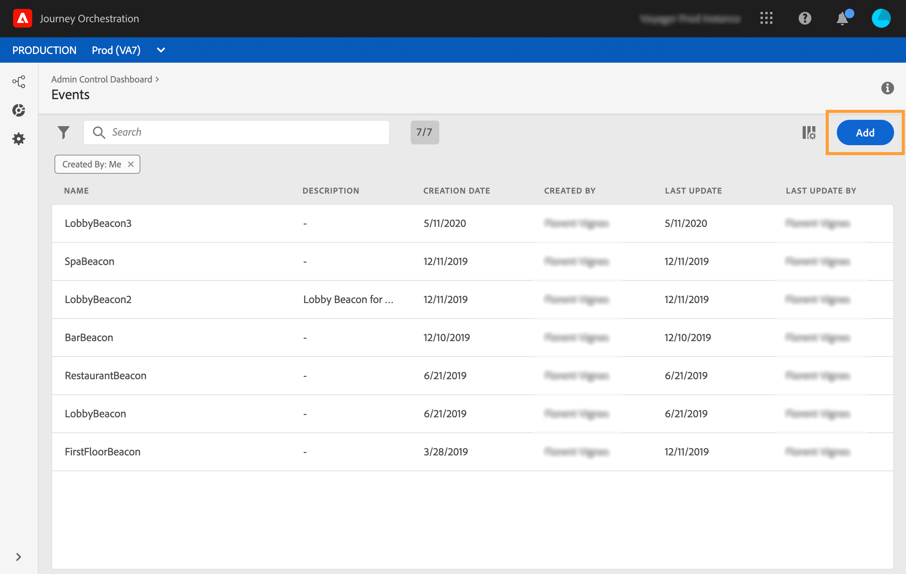
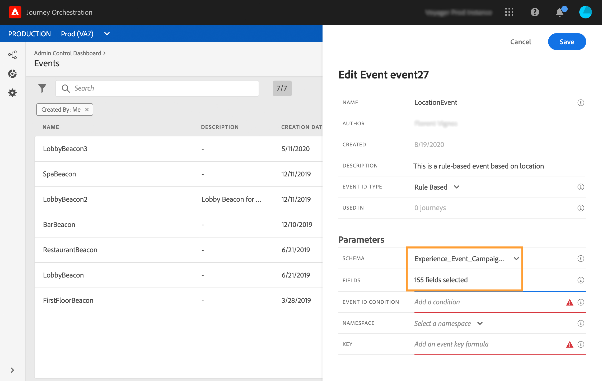

# Regelbaserade händelser{#simplified-events}

Vi har förenklat hur ni konfigurerar Experience Events. Vi introducerar en ny metod som inte kräver att ett eventID används. När du konfigurerar en händelse i Journey Orchestration kan du nu definiera en regelbaserad händelse.

Den här nya händelsetypen genererar inget eventID. Med den enkla uttrycksredigeraren definierar du nu helt enkelt en regel som ska användas av systemet för att identifiera de relevanta händelser som utlöser dina resor. Den här regeln kan baseras på alla fält som är tillgängliga i händelsenyttolasten, till exempel profilens plats eller antalet objekt som läggs till i profilens kundvagn.

Den här nya metoden är för det mesta genomskinlig för användarna. Den enda ändringen är ett nytt fält på skärmen för händelsdefinition.

## Utnyttja Adobe Analytics data{#analytics-data}

>[!NOTE]
>
>Detta avsnitt gäller endast kunder som behöver använda Adobe Analytics-data.

Ni kan utnyttja alla Adobe Analytics beteendehändelsedata som ni redan samlar in och strömmar till plattformen för att utlösa resor och automatisera kundernas upplevelser.

För att detta ska fungera måste du aktivera rapportsviten som du vill utnyttja i Adobe Experience Platform:

1. I Adobe Experience Platform väljer du **[!UICONTROL Sources]** sedan **[!UICONTROL Add data]** i avsnittet Adobe Analytics. En lista över tillgängliga Adobe Analytics-rapportsviter visas.

1. Välj den rapportsvit som du vill aktivera, klicka **[!UICONTROL Next]** och klicka på **[!UICONTROL Finish]**.

1. Dela källdata-ID:t med alfaprogrammets kontaktpunkt.

Detta aktiverar Analytics-källkopplingen för den rapportsviten. När informationen kommer in omvandlas den till en Experience-händelse och skickas till Adobe Experience Platform.

Mer information om Adobe Analytics källanslutning finns i [dokumentationen](https://docs.adobe.com/help/en/experience-platform/sources/connectors/adobe-applications/analytics.html) och [självstudiekursen](https://docs.adobe.com/content/help/en/experience-platform/sources/ui-tutorials/create/adobe-applications/analytics.html).

## Konfigurera en regelbaserad händelse{#configuring-rule-based}

1. Klicka på **[!UICONTROL Admin]** ikonen i den vänstra menyn och klicka sedan på **[!UICONTROL Events]**. Listan med händelser visas.

   

1. Klicka på **[!UICONTROL Add]** för att skapa en ny händelse. Konfigurationsfönstret för händelsen öppnas till höger på skärmen.

   

1. Ange namnet på händelsen. Du kan också lägga till en beskrivning.

   

1. In the new **[!UICONTROL Event ID type]** field, select **[!UICONTROL Rule Based]**.

   

   >[!NOTE]
   >
   >Typen är den befintliga metoden som kräver ett eventID. **[!UICONTROL System Generated]** Se [det här avsnittet](../event/about-events.md).

1. Definiera **[!UICONTROL Schema]** och nyttolast **[!UICONTROL Fields]**. Se [det här avsnittet](../event/defining-the-payload-fields.md).

   

   >[!NOTE]
   >
   >När du väljer **[!UICONTROL System Generated type]** det här alternativet är endast scheman med typen eventID tillgängliga. När du väljer **[!UICONTROL Rule Based]** typ är alla Experience Event-scheman tillgängliga.

1. Klicka inuti **[!UICONTROL Event ID condition]** fältet. Använd den enkla uttrycksredigeraren för att definiera villkoret som ska användas av systemet för att identifiera de händelser som utlöser din resa.

   

   I vårt exempel skrev vi ett villkor baserat på profilens stad. Det innebär att när systemet tar emot en händelse som matchar det här villkoret (**[!UICONTROL City]** fält och **[!UICONTROL Paris]** värde) skickas den till Journey Orchestration.

1. Definiera **[!UICONTROL Namespace]** och **[!UICONTROL Key]**. Se [Markera namnutrymmet](../event/selecting-the-namespace.md) och [definiera händelsenyckeln](../event/defining-the-event-key.md).

   

De andra stegen för händelsekonfiguration och skapande av resa ändras inte.

Händelsen är nu konfigurerad och klar att släppas in på en resa som vilken händelse som helst. Varje gång en händelse som matchar regeln skickas till systemet, skickas den till Journey Orchestration för att utlösa dina resor.

## Testläge för regelbaserade händelser{#test-rule-based}

Testläget är även tillgängligt för resor som använder en regelbaserad händelse.

När du utlöser en händelse kan du på skärmen för **händelsekonfiguration** definiera de händelseparametrar som ska passera i testet. Du kan visa händelse-ID-villkoret genom att klicka på verktygstipsikonen i det övre högra hörnet. Det finns också ett verktygstips bredvid varje fält som ingår i regelutvärderingen.

Mer information om hur du använder testläget finns i .

