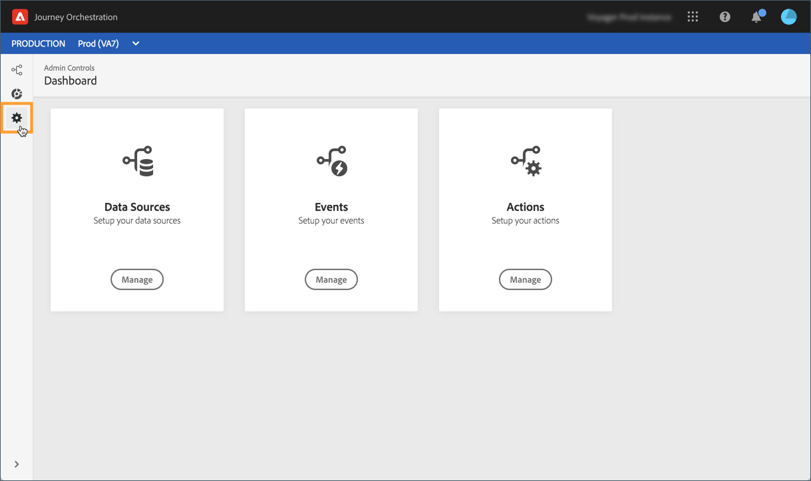

# Upptäcka Alpha-versionsgränssnittet {#discovering-alpha-interface}

## Om alfaversionsgränssnittet {#about-alpha-interface}

Navigeringen på [!DNL Journey Orchestration] menyer har förbättrats för att ge ett konsekvent gränssnitt med Adobe Experience Platform. Ändringarna omfattar:

* Menyer som har flyttats från den övre till den vänstra sidan av gränssnittet,
* Gruppering av administratörsfunktioner i en enda kontrollpanel.

I [det här avsnittet](../about/user-interface.md)beskrivs globala koncept för hur du använder och navigerar i gränssnittet (sökning och filtrering, bläddring i Adobe Experience Platform-fält, genvägar).

## Åtkomst till [!DNL Journey Orchestration] funktioner {#accessing-journey-orchestration-functionalities}

Menyraden till vänster ger dig tillgång till de olika funktionerna. Klicka på en ikon för att öppna motsvarande meny. Du kan klicka på pilen längst ned till vänster om du vill expandera eller komprimera menyraden.

När du öppnar [!DNL Journey Orchestration]visas **[!UICONTROL Journeys]** menyn så att du kan komma åt befintliga resor eller skapa nya. See [Using the journey designer](../building-journeys/using-the-journey-designer.md).

På **[!UICONTROL Segments]** menyn kan du komma åt och skapa Adobe Experience Platform-segment. Se [Om Adobe Experience Platform-segment](../segment/about-segments.md).

Menyn **[!UICONTROL Admin]** är tillgänglig för alla användare med administratörsbehörighet (se [Åtkomsthantering](../about/access-management.md)). Här finns en kontrollpanel där du kan konfigurera [datakällor](../datasource/about-data-sources.md), [händelser](../event/about-events.md) och [åtgärder](../action/action.md).

