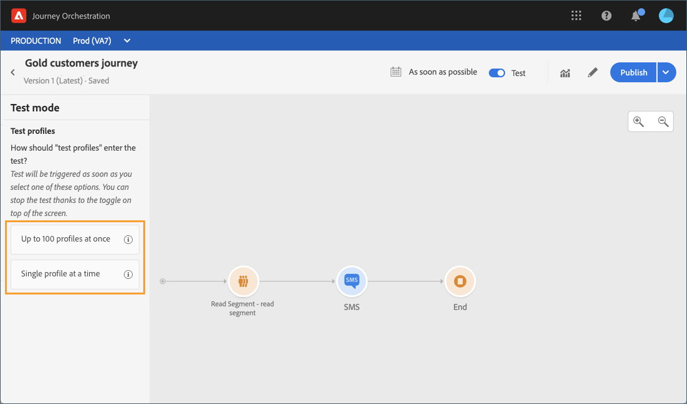

# Läsa segmentaktivitet {#segment-trigger-activity}

## Om aktiviteten Läs segment {#about-segment-trigger-actvitiy}

>[!NOTE]
>
>Om det finns en färdig Adobe Campaign Standard-åtgärd på arbetsytan vid publiceringstid eller aktiveringstid i testläge kommer resan att strypas vid 13 ingångar per sekund. Annars begränsas resan till 1 000 händelser per sekund.

Med Läs segment-aktiviteten kan alla personer som tillhör ett Adobe Experience Platform-segment delta i en resa. Inträde i en resa kan genomföras antingen en gång eller regelbundet.

Säg att du har ett Guldkundssegment på Adobe Experience Platform. Med aktiviteten Läs segment kan alla personer som tillhör kundsegmentet Gold ta sig in på en resa och få dem att flöda in i personaliserade resor som utnyttjar alla resefunktioner: villkor, timers, events, actions.

## Konfigurera aktiviteten {#configuring-segment-trigger-activity}

>[!NOTE]
>
>På grund av fördröjningar för segmentexport går det inte att utlösa en segmentbaserad resa inom en kortare tidsram än en timme.

1. Ge kategorin en ny **[!UICONTROL Orchestration]** dimension och släpp en **[!UICONTROL Read Segment]** aktivitet på arbetsytan.

   Aktiviteten måste placeras som det första steget i en resa.

1. Lägg till en aktivitet **[!UICONTROL Label]** (valfritt).

1. I **[!UICONTROL Segment]** fältet väljer du det Adobe Experience Platform-segment som ska användas för resan och klickar sedan på **[!UICONTROL Save]**.

   >[!NOTE]
   >
   >Observera att du kan anpassa kolumnerna som visas i listan och sortera dem.

   

   När du har lagt till segmentet kan du med knappen kopiera dess namn och ID: **[!UICONTROL Copy]**

   `{"name":"Gold customers,”id":"8597c5dc-70e3-4b05-8fb9-7e938f5c07a3"}`

   

1. I **[!UICONTROL Namespace]** fältet väljer du det namnutrymme som ska användas för att identifiera personerna. For more on namespaces, refer to [this section](../event/selecting-the-namespace.md).

   >[!NOTE]
   >
   >Individer som tillhör ett segment som inte har den valda identiteten (namnutrymmet) bland sina olika identiteter kan inte ta sig in på resan.

1. Med hjälp av den här **[!UICONTROL Read Segment]** aktiviteten kan du ange vid vilken tidpunkt segmentet ska börja färden. Det gör du genom att klicka på **[!UICONTROL Edit journey schedule]** länken för att komma åt resans egenskaper och sedan konfigurera **[!UICONTROL Scheduler type]** fältet.

   

   Som standard färdas segmenten in på resan, **[!UICONTROL As soon as possible]** vilket innebär en timme efter det att resan har publicerats. Om du vill att segmentet ska anges på en viss dag/tid eller på en återkommande basis, väljer du önskat värde i listan.

   >[!NOTE]
   >
   >Observera att **[!UICONTROL Schedule]** avsnittet endast är tillgängligt när en **[!UICONTROL Read Segment]** aktivitet har släppts på arbetsytan.

   

## Testa och publicera resan {#testing-publishing}

Med den här **[!UICONTROL Read Segment]** aktiviteten kan du testa resan antingen med en enhetlig profil eller med 100 slumpmässiga testprofiler som valts bland de profiler som är kvalificerade för segmentet.

Aktivera testläget och välj sedan önskat alternativ i den vänstra rutan.

Sedan kan du konfigurera och köra testläget som vanligt. Detaljerade anvisningar om hur du testar en resa finns i [detta avsnitt](../building-journeys/testing-the-journey.md).

När testet är igång kan du med knappen **[!UICONTROL Show logs]** se testresultaten enligt det valda testalternativet:

* **[!UICONTROL Single profile at a time]**: testloggarna visar samma information som när det enhetstestläget används. Mer information om detta finns i [det här avsnittet](../building-journeys/testing-the-journey.md#viewing_logs)

* **[!UICONTROL Up to 100 profiles at once]**: Med testloggarna kan du följa hur segmentexporten från Adobe Experience Platform fortskrider samt hur alla personer som passerat resan fortskrider.

   Observera att det inte går att följa förloppet för de personer som befinner sig på resan med hjälp av det visuella flödet om du testar resan med upp till 100 profiler samtidigt.

   

När testerna är slutförda kan du publicera din resa (se [Publicera resan](../building-journeys/publishing-the-journey.md)). Enskilda personer som tillhör segmentet kommer in i resan på det datum/den tidpunkt som anges i **[!UICONTROL Scheduler]** avsnittet om färdens egenskaper.

>[!NOTE]
>
>När du gör en ny version av en segmentbaserad resa som inte är återkommande (med början så snart som möjligt eller &quot;en gång&quot;) kommer alla personer som tidigare passerat resan inte att ange sin nya version igen när du kommer att publicera den. Om du vill att de ska kunna resa igen bör du duplicera resan.
