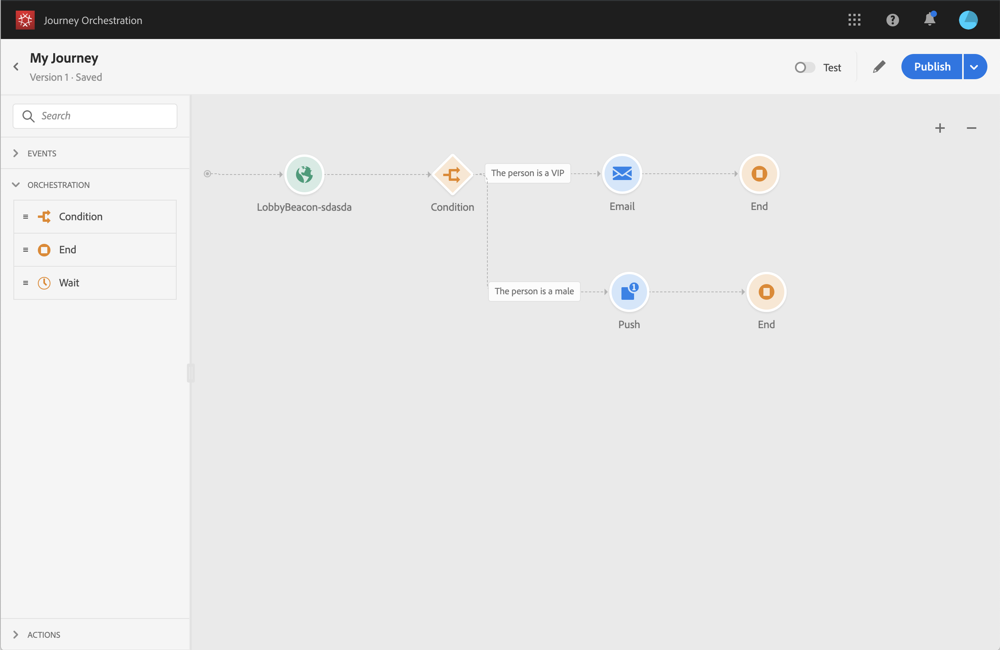

# Villkorsaktivitet{#section_e2n_pft_dgb}

Det finns fyra typer av villkor:

* [Datakällans villkor](#data_source_condition)
* [Tidsvillkor](#time_condition)
* [Procentdelning](#percentage_split)
* [Datumvillkor](#date_condition)

## Om villkorsaktiviteten {#about_condition}

När du använder flera villkor under en resa kan du definiera etiketter för var och en av dem för att lättare kunna identifiera dem.

Klicka på **[!UICONTROL Add a path]** om du vill definiera flera villkor. För varje villkor läggs en ny bana till på arbetsytan efter aktiviteten.

Observera att utformningen av resorna har funktionell inverkan. När flera sökvägar definieras efter ett villkor kommer endast den första giltiga sökvägen att köras. Det innebär att du kan ändra prioriteringen av banor genom att placera dem över eller under varandra.

Låt oss till exempel ta exemplet med den första sökvägens villkor&quot;Personen är en VIP&quot; och en andra sökvägs villkor&quot;Personen är en man&quot;. Om en person som uppfyller båda villkoren (en man som är en VIP) klarar det här steget väljs den första banan även om han även är berättigad till den andra, eftersom den första sökvägen är &quot;ovan&quot;. Om du vill ändra den här prioriteten flyttar du dina aktiviteter i en annan lodrät ordning.

Du kan skapa en annan sökväg för målgrupper som inte uppfyller de definierade villkoren genom att markera **[!UICONTROL Show path for other cases than the one(s) above]**. Observera att det här alternativet inte är tillgängligt vid delning. Se [Procentuell delning](#percentage_split).

I det enkla läget kan du utföra enkla frågor baserat på en kombination av fält. Alla tillgängliga fält visas till vänster på skärmen. Dra och släpp fält till huvudzonen. Om du vill kombinera de olika elementen, låser du ihop dem till varandra för att skapa olika grupper och/eller gruppnivåer. Du kan sedan välja en logisk operatör för att kombinera element på samma nivå:

* OCH: en korsning av två kriterier. Endast de element som uppfyller alla villkor beaktas.
* ELLER: en förening av två kriterier. Element som matchar minst ett av de två villkoren beaktas.

Om du använder [Adobe Experience Platform segmenteringstjänst](https://docs.adobe.com/content/help/en/experience-platform/segmentation/home.html) för att skapa dina segment kan du utnyttja dem under dina reseförhållanden. Se [Använda segment i villkor](../segment/using-a-segment.md).

>[!NOTE]
>
>Du kan inte utföra frågor på tidsserier (till exempel en lista över inköp, tidigare klick på meddelanden) med den enkla redigeraren. För detta behöver du den avancerade redigeraren. Läs [den här sidan](../expression/expressionadvanced.md).

När ett fel inträffar i en åtgärd eller ett villkor upphör en individs resa. Det enda sättet att få den att fortsätta är att markera rutan **[!UICONTROL Add an alternative path in case of a timeout or an error]**. Se [det här avsnittet](../building-journeys/using-the-journey-designer.md#paths).

## Datakällans villkor {#data_source_condition}

På så sätt kan du definiera ett villkor baserat på fält från datakällorna eller händelser som tidigare placerats under resan. Mer information om hur du använder uttrycksredigeraren finns i [den här sidan](../expression/expressionadvanced.md). Med den avancerade uttrycksredigeraren kan du ställa in mer avancerade villkor för att hantera samlingar eller använda datakällor som kräver att parametrar skickas. Läs [den här sidan](../datasource/external-data-sources.md).

## Tidsvillkor{#time_condition}

På så sätt kan du utföra olika åtgärder beroende på timmen på dagen och/eller veckodagen. Du kan till exempel bestämma dig för att skicka SMS-meddelanden under dagtid och e-postmeddelanden på natten under vardagar.

>[!NOTE]
>
>Tidszonen är inte längre specifik för ett villkor och har nu definierats på färdsnivå i färdegenskaperna. Se [den här sidan](../building-journeys/timezone-management.md).

## Procentuell delning {#percentage_split}

Med det här alternativet kan du slumpmässigt dela målgruppen för att definiera olika åtgärder för varje grupp. Definiera antalet delningar och partitioneringen för varje sökväg. Delningsberäkningen är statistisk eftersom systemet inte kan förutse hur många personer som kommer att flöda i den här kundresan. Därför har delningen en mycket låg felmarginal. Den här funktionen är baserad på en slumpmässig Java-mekanism (se den här [sidan](https://docs.oracle.com/javase/7/docs/api/java/util/Random.html)).

>[!NOTE]
>
>Observera att det inte finns någon knapp för att lägga till en bana i det procentuella delningsvillkoret. Antalet banor beror på antalet delningar. I delningsvillkor kan du inte lägga till en sökväg för andra fall eftersom det inte kan ske. Folk kommer alltid att gå in på en av de delade vägarna.

## Datumvillkor {#date_condition}

På så sätt kan du definiera ett annat flöde baserat på datumet. Om personen till exempel går in i steget under&quot;försäljningsperioden&quot; skickar du ett specifikt meddelande till honom. Resten av året skickar du ett nytt meddelande.

>[!NOTE]
>
>Tidszonen är inte längre specifik för ett villkor och har nu definierats på färdsnivå i färdegenskaperna. Läs [den här sidan](../building-journeys/timezone-management.md).

