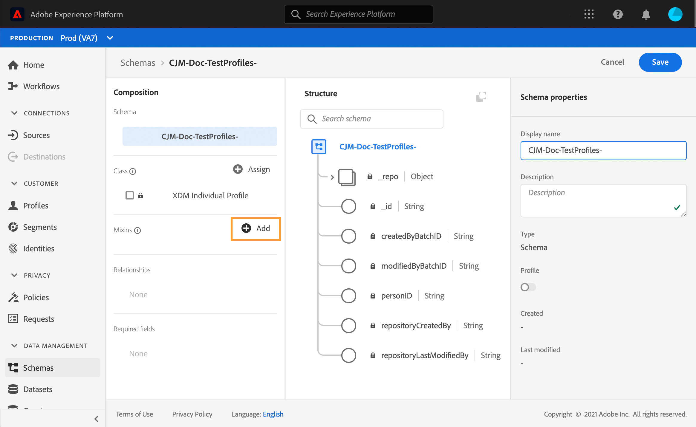
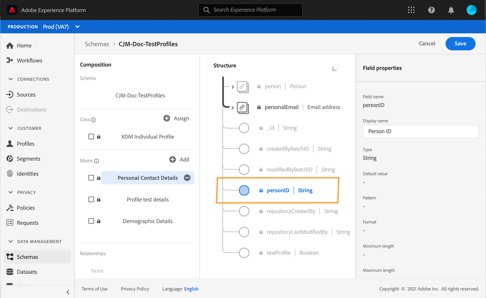
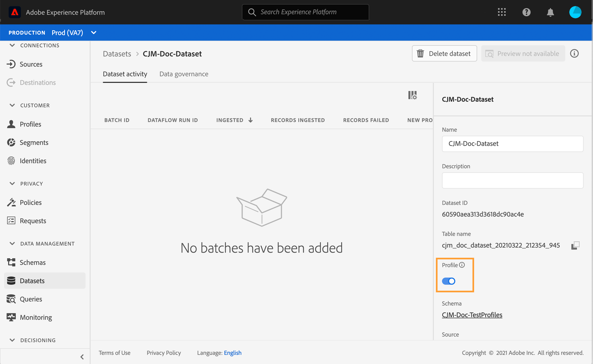
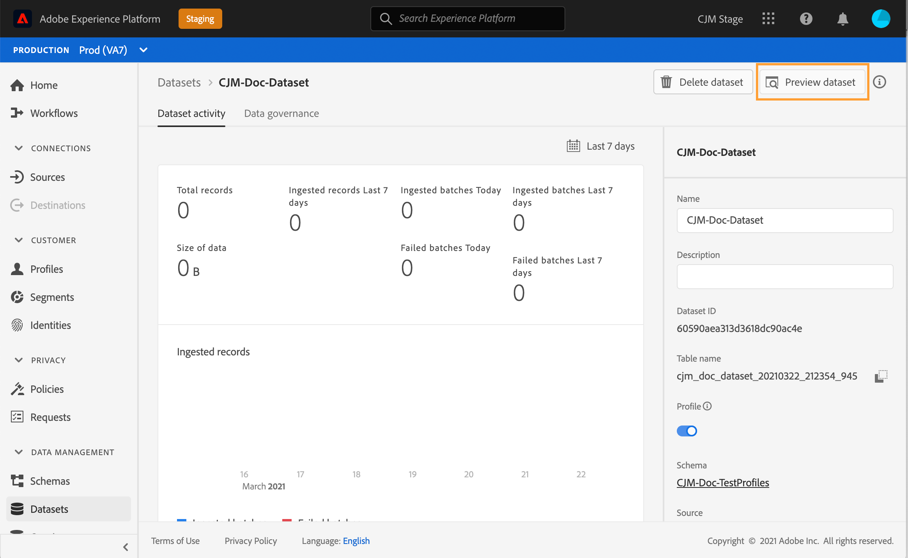

# Skapa testprofiler {#create-test-profiles}

Testprofiler krävs när testläget används under en resa. Mer information om hur du använder testläget finns i [det här avsnittet](../building-journeys/testing-the-journey.md).

Det finns olika sätt att skapa en testprofil i Adobe Experience Platform. I den här dokumentationen fokuserar vi på två metoder: överföra en [csv-fil](../building-journeys/creating-test-profiles.md#create-test-profiles-csv) och använda [API-anrop](../building-journeys/creating-test-profiles.md#create-test-profiles-api). Du kan också överföra en json-fil i en datauppsättning, se [dokumentationen för datainmatning](https://experienceleague.adobe.com/docs/experience-platform/ingestion/tutorials/ingest-batch-data.html#add-data-to-dataset).

Med de här importmetoderna kan du även uppdatera profilattribut. På så sätt kan du omvandla en befintlig profil till en testprofil. Använd bara ett liknande fil- eller API-anrop och inkludera bara fältet&quot;testProfile&quot; med värdet&quot;true&quot;.

Att skapa en testprofil liknar att skapa vanliga profiler i Adobe Experience Platform. Mer information finns i [dokumentationen för kundprofilen i realtid](https://experienceleague.adobe.com/docs/experience-platform/profile/home.html).

## Förhandskrav{#test-profile-prerequisites}

För att kunna skapa profiler måste du först skapa ett schema och en datauppsättning i Adobe Experience Platform.

Först måste du **skapa ett schema**. Följ de här stegen:

1. Klicka på **[!UICONTROL Schemas]** i den vänstra menyn i Adobe Experience Platform.
   
1. Klicka på **[!UICONTROL Create schema]** i det övre högra hörnet och välj sedan en schematyp, till exempel **[!UICONTROL XDM Individual Profile]**.
   
1. Välj ett namn för schemat.
1. Klicka på **[!UICONTROL Add]** i **[!UICONTROL Mixins]**-avsnittet.
   
1. Välj lämpliga mixar. Se till att du lägger till **[!UICONTROL Profile test details]**-blandningen. Klicka på **[!UICONTROL Add mixin]**.
   
Listan med mixar visas på schemaöversiktsskärmen.

   
1. I listan med fält klickar du på det fält som du vill definiera som primär identitet.
   
1. I den högra panelen **[!UICONTROL Field properties]** kontrollerar du alternativen **[!UICONTROL Identity]** och **[!UICONTROL Primary Identity]** och väljer ett namnutrymme. Om du vill att den primära identiteten ska vara en e-postadress väljer du namnutrymmet **[!UICONTROL Email]**. Klicka på **[!UICONTROL Apply]**.
   
1. Markera schemat och aktivera alternativet **[!UICONTROL Profile]** i **[!UICONTROL Schema properties]**.
   
1. Klicka på **[!UICONTROL Save]**.

>[!NOTE]
>
>Mer information om schemaskapande finns i [XDM-dokumentationen](https://experienceleague.adobe.com/docs/experience-platform/xdm/ui/resources/schemas.html#prerequisites).

Sedan måste du **skapa datauppsättningen** som profilerna ska importeras i. Följ de här stegen:

1. I Adobe Experience Platform klickar du på **[!UICONTROL Datasets]** på den vänstra menyn och sedan på **[!UICONTROL Create dataset]**.
   
1. Välj **[!UICONTROL Create dataset from schema]**.
   
1. Markera det tidigare skapade schemat och klicka sedan på **[!UICONTROL Next]**.
   
1. Välj ett namn och klicka sedan på **[!UICONTROL Finish]**.
   
1. Aktivera alternativet **[!UICONTROL Profile]**.
   

>[!NOTE]
>
> Mer information om hur du skapar datauppsättningar finns i [dokumentationen för katalogtjänsten](https://experienceleague.adobe.com/docs/experience-platform/catalog/datasets/user-guide.html#getting-started).

## Skapa en testprofil med en CSV-fil{#create-test-profiles-csv}

I Adobe Experience Platform kan du skapa profiler genom att överföra en CSV-fil som innehåller de olika profilfälten till datauppsättningen. Det här är den enklaste metoden.

1. Skapa en enkel csv-fil med ett kalkylprogram.
1. Lägg till en kolumn för varje fält som behövs. Se till att du lägger till det primära identitetsfältet (&quot;personID&quot; i exemplet ovan) och att fältet&quot;testProfile&quot; är inställt på&quot;true&quot;.
   
1. Lägg till en rad per profil och fyll i värdena för varje fält.
   
1. Spara kalkylbladet som en CSV-fil. Se till att kommatecken används som avgränsare.
1. Klicka på **[!UICONTROL Workflows]** i den vänstra menyn i Adobe Experience Platform.
   
1. Välj **[!UICONTROL Map CSV to XDM schema]** och klicka sedan på **[!UICONTROL Launch]**.
   
1. Markera den datauppsättning som du vill importera profilerna till. Klicka på **[!UICONTROL Next]**.
   
1. Klicka på **[!UICONTROL Choose files]** och välj din CSV-fil. När filen har överförts klickar du på **[!UICONTROL Next]**.
   
1. Mappa CSV-källfälten till schemafälten och klicka sedan på **[!UICONTROL Finish]**.
   
1. Dataimporten börjar. Statusen ändras från **[!UICONTROL Processing]** till **[!UICONTROL Success]**. Klicka på **[!UICONTROL Preview data set]** i det övre högra hörnet.
   
1. Kontrollera att testprofilerna har lagts till korrekt.
   

Testprofilerna läggs till och kan nu användas när du testar en resa. Se [det här avsnittet](../building-journeys/testing-the-journey.md).
>[!NOTE]
>
> Mer information om csv-import finns i [dokumentationen för datainmatning](https://experienceleague.adobe.com/docs/experience-platform/ingestion/tutorials/map-a-csv-file.html#tutorials).

## Skapa testprofiler med API-anrop{#create-test-profiles-api}

Du kan också skapa testprofiler via API-anrop. Läs den här [sidan](https://experienceleague.adobe.com/docs/experience-platform/profile/home.html).

Du måste använda ett profilschema som innehåller blandningen &quot;Profiltestinformation&quot;. Flaggan testProfile ingår i den här mixinen.

När du skapar en profil måste du skicka värdet: testProfile = true.

Observera att du även kan uppdatera en befintlig profil för att ändra dess testProfile-flagga till &quot;true&quot;.

Här är ett exempel på ett API-anrop för att skapa en testprofil:

```
curl -X POST \
'https://dcs.adobedc.net/collection/xxxxxxxxxxxxxx' \
-H 'Cache-Control: no-cache' \
-H 'Content-Type: application/json' \
-H 'Postman-Token: xxxxx' \
-H 'cache-control: no-cache' \
-H 'x-api-key: xxxxx' \
-H 'x-gw-ims-org-id: xxxxx' \
-d '{
"header": {
"msgType": "xdmEntityCreate",
"msgId": "xxxxx",
"msgVersion": "xxxxx",
"xactionid":"xxxxx",
"datasetId": "xxxxx",
"imsOrgId": "xxxxx",
"source": {
"name": "Postman"
},
"schemaRef": {
"id": "https://example.adobe.com/mobile/schemas/xxxxx",
"contentType": "application/vnd.adobe.xed-full+json;version=1"
}
},
"body": {
"xdmMeta": {
"schemaRef": {
"contentType": "application/vnd.adobe.xed-full+json;version=1"
}
},
"xdmEntity": {
"_id": "xxxxx",
"_mobile":{
"ECID": "xxxxx"
},
"testProfile":true
}
}
}'
```
