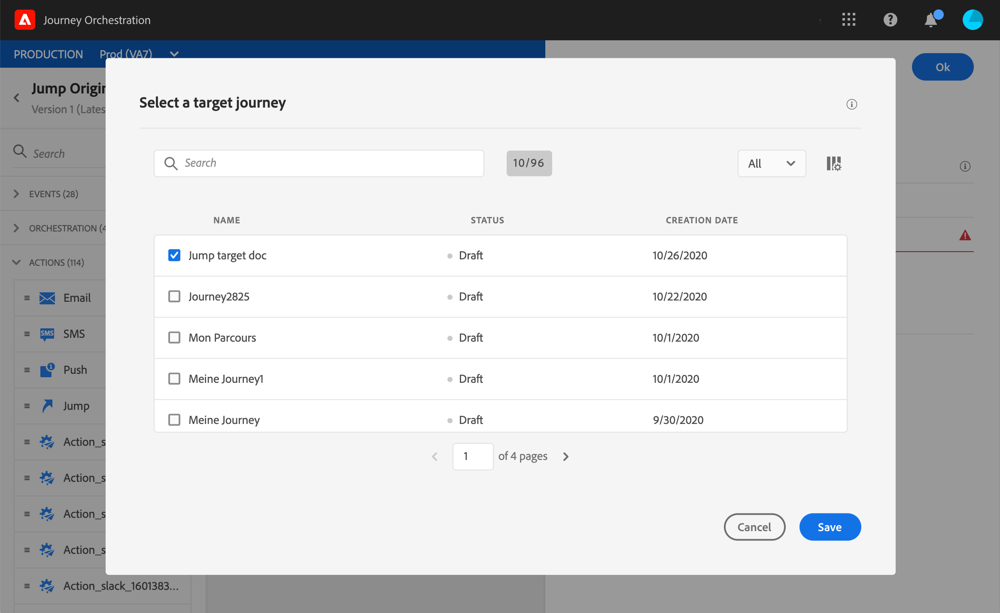
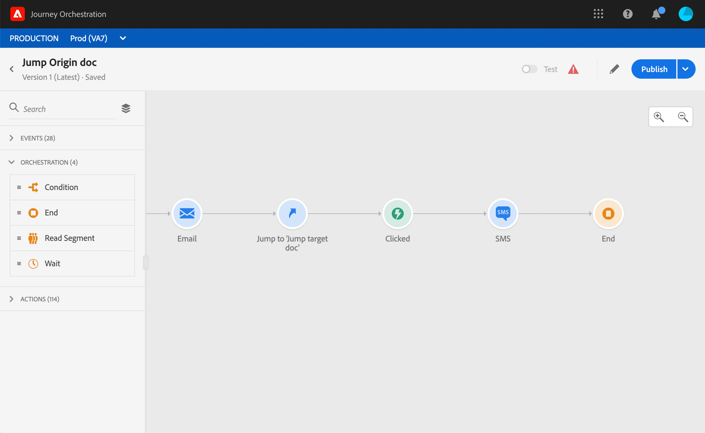

# Hoppa från en resa till en annan {#jump}

>[!NOTE]
>
>Effektiv tillgänglighet: 15 november 2020

Med aktiviteten **Hoppåtgärd** kan ni föra människor från en resa till en annan. Med den här funktionen kan du:

* förenkla utformningen av mycket komplexa resor genom att dela upp dem i flera.
* bygga resor baserat på gemensamma och återanvändbara resemönster

Lägg bara till en **hopp** i den ursprungliga resan och välj en målresa. När personen går över i hoppsteget skickas en intern händelse till den första händelsen i målresan. Om hoppåtgärden lyckas fortsätter personen att göra framsteg på resan. Beteendet liknar andra åtgärder.

Under målresan kommer den första händelsen som utlöses internt av hoppet att få det enskilda flödet i resan.

## Livscykel

Säg att du har lagt till ett hopp i en resa A till en resa B. Resa A är **ursprungsresan** och resa B, **målresan**.
Här är de olika stegen i körningsprocessen:

**Resa A** utlöses från en extern händelse:

1. Resa A får en extern händelse som rör en individ.
1. Personen kommer till hoppsteget.
1. Personen flyttas till resa B och fortsätter till nästa steg i resa A, efter hoppet.

Under **resa B** kan den första händelsen utlösas externt (som en vanlig händelse) eller internt, via ett hopp från resa A:

1. Resan B fick en intern händelse från resa A.
1. Den första händelsen med resa B utlöses av information från resa A.
1. Personen börjar flyta i resa B.

## Viktiga anteckningar

* Du kan bara hoppa till en resa som använder samma namnutrymme som ursprungsresan.
* Du kan inte hoppa till en resa som börjar med en **segmentkvalificeringshändelse** .
* När hoppet är klart aktiveras den senaste versionen av målresan.
* Du kan inkludera så många hopp som du behöver under en resa. Efter ett hopp kan du lägga till alla aktiviteter som behövs.
* Du kan ha så många hoppnivåer som behövs. Till exempel hoppar resa A till resa B, som hoppar till resa C och så vidare.
* Målresan kan även omfatta så många hopp som behövs.
* Loopmönster stöds inte. Det finns inget sätt att länka samman två eller flera resor som skulle skapa en oändlig slinga. Konfigurationsskärmen för **hoppaktivitet** förhindrar att du gör detta.
* Som vanligt kan en unik individ bara vara närvarande en gång under samma resa. Om den person som har åsamkats från ursprungsresan redan befinner sig på målresan, kommer personen alltså inte att ta sig in på målresan. Inget fel rapporteras om hoppet eftersom det är ett normalt beteende.

## Konfigurera hoppet

1. Designa din originalresa.

   

1. Under hela resan lägger du till en **hoppaktivitet** i kategorin **Åtgärd** . Lägg till en etikett och en beskrivning.

   

1. Klicka i fältet **Målresa** .
I listan visas alla reseversioner som är utkast, live eller i testläge. Resor som använder ett annat namnutrymme eller som börjar med en **Segment-kvalificeringshändelse** är inte tillgängliga. Målresor som skulle skapa ett slingmönster filtreras också bort.

   

   >[!NOTE]
   >
   >Du kan klicka på ikonen **Öppna målresa** till höger för att öppna målresan på en ny flik.

1. Välj den målresa som du vill hoppa till.
Fältet **Första händelse** är förifyllt med namnet på målresans första händelse. Om målresan innehåller flera händelser tillåts hoppet bara vid den första händelsen.

   

1. I avsnittet **Åtgärdsparametrar** visas alla fält i målhändelsen. På samma sätt som för andra typer av åtgärder mappar du varje fält med fält från ursprungshändelsen eller datakällan. Den här informationen skickas till målresan vid körning.
1. Lägg till nästa aktiviteter för att slutföra din ursprungliga resa.

   

Ditt hopp är konfigurerat. Så snart din resa är live eller i testläge kommer personer som når hoppet att pushas från till målresan.

När ett hopp är konfigurerat på en resa läggs en ikon för att hoppa in automatiskt till i början av målresan. Detta hjälper er att identifiera att resan kan utlösas externt men också internt från ett hopp.

## Felsökning

När resan publiceras eller i testläge inträffar fel om:
* målresan inte längre existerar
* målresan är utkast, avslutad eller stoppad
* om den första händelsen i målresan har ändrats och mappningen är bruten
