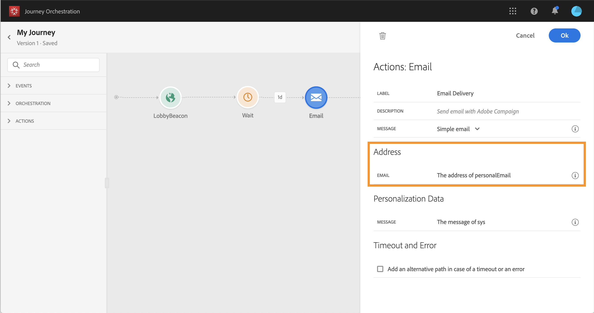

# Använda Adobe Campaign Standard {#using_campaign_action}

Om du har Adobe Campaign Standard finns följande färdiga åtgärdsaktiviteter: **[!UICONTROL Email]**, **[!UICONTROL Push]** och **[!UICONTROL SMS]**.

>[!NOTE]
>
>Därför måste du konfigurera den inbyggda åtgärden. Se [den här sidan](../action/working-with-adobe-campaign.md).

För var och en av dessa kanaler väljer du en Adobe Campaign Standard Transactional Messaging **mall**. Ja, [!DNL Journey Orchestration] är inte en lösning för att skicka meddelanden. För de inbyggda e-post-, SMS- och push-kanalerna använder vi Transactional Messaging för att skicka meddelanden. Det innebär att om du vill använda en viss meddelandemall under dina resor måste du publicera den i Adobe Campaign Standard. Se [den här sidan](https://experienceleague.adobe.com/docs/campaign-standard/using/communication-channels/transactional-messaging/getting-started-with-transactional-msg.html?lang=sv) om du vill lära dig hur du använder den här funktionen.

>[!NOTE]
>
>Campaign Standardens transaktionsmeddelande och tillhörande händelse måste publiceras för att kunna användas i Journey Orchestration. Om händelsen publiceras men meddelandet inte visas visas den inte i Journey Orchestration-gränssnittet. Om meddelandet publiceras men dess associerade händelse inte är det visas det i Journey Orchestration-gränssnittet, men det går inte att använda det.


Du kan använda en händelsemall (kallas även realtid) eller en transaktionsmall för profiler.

>[!NOTE]
>
>När vi skickar transaktionsmeddelanden i realtid (rtEvent) eller när vi dirigerar meddelanden med ett tredjepartssystem tack vare en anpassad åtgärd krävs en särskild konfiguration för hantering av trötthet, blockeringslista eller prenumerationer. Om till exempel attributet &quot;unsubscribe&quot; lagras i Adobe Experience Platform eller i ett tredjepartssystem måste ett villkor läggas till innan meddelandet skickas för att det här villkoret ska kunna kontrolleras.

När du väljer en mall visas alla fält som förväntas i meddelandenyttolasten i aktivitetskonfigurationsrutan under **[!UICONTROL Address]** och **[!UICONTROL Personalization Data]**. Du måste mappa vart och ett av dessa fält till det fält som du vill använda, antingen från händelsen eller från datakällan. Du kan också använda den avancerade uttrycksredigeraren för att skicka ett värde manuellt, utföra databearbetning på hämtad information (t.ex. konvertera en sträng till versaler) eller använda funktioner som &quot;if, then, else&quot;. Läs [den här sidan](../expression/expressionadvanced.md).


## E-post och SMS {#section_asc_51g_nhb}

För **[!UICONTROL Email]** och **[!UICONTROL SMS]**, parametrarna är identiska.

>[!NOTE]
>
>Om du använder en transaktionsmall för profiler för e-post hanteras avprenumerationsfunktionen som Campaign Standard. Du lägger bara till en **[!UICONTROL Unsubscription link]** innehållsblock i mallen ([läs mer](https://experienceleague.adobe.com/docs/campaign-standard/using/communication-channels/transactional-messaging/getting-started-with-transactional-msg.html)). Om du använder en händelsebaserad mall (rtEvent) måste du i meddelandet lägga till en länk som skickar personens e-post i URL-parametern och pekar på en startsida som inte är en prenumeration. Du måste skapa den här landningssidan och se till att personens beslut att avbryta prenumerationen skickas till Adobe.

Först måste du välja en transaktionsmall. Se [den här sidan](../building-journeys/about-action-activities.md).

Det finns två kategorier: **[!UICONTROL Address]** och **[!UICONTROL Personalization Data]**.

Du kan enkelt ange var du vill hämta **[!UICONTROL Address]** eller **[!UICONTROL Personalization Data]** med gränssnittet. Du kan bläddra bland händelser och den tillgängliga datakällans fält. Du kan också använda den avancerade uttrycksredigeraren för mer avancerade användningsområden, som att använda en datakälla som kräver att parametrar skickas eller att manipulationer utförs. Läs [den här sidan](../expression/expressionadvanced.md).

**[!UICONTROL Address]**

>[!NOTE]
>
>Den här kategorin är bara synlig om du väljer ett transaktionsmeddelande av typen &quot;event&quot;. För &quot;profilmeddelanden&quot; visas **[!UICONTROL Address]** -fältet hämtas automatiskt från Adobe Campaign Standard av systemet.

Det här är de fält som systemet behöver för att kunna skicka meddelandet. För en e-postmall är det e-postadressen. För ett SMS är det mobiltelefonnumret.



**[!UICONTROL Personalization Data]**

>[!NOTE]
>
>Du kan inte skicka en samling med personaliseringsdata. Om transaktionsmeddelandet eller SMS förväntar sig samlingar fungerar det inte. Observera också att personaliseringsdata har ett förväntat format (exempel: sträng, decimal osv.). Du måste vara försiktig med att ta hänsyn till dessa förväntade format.

Detta är de fält som förväntas av Adobe Campaign Standard-meddelandet. Dessa fält kan användas för att anpassa meddelandet, använda villkorsstyrd formatering eller välja en viss meddelandevariant.


## Push {#section_im3_hvf_nhb}

Innan du använder push-aktiviteten måste din mobilapp konfigureras tillsammans med Campaign Standard för att skicka push-meddelanden. Använd den här [artikel](https://helpx.adobe.com/se/campaign/kb/integrate-mobile-sdk.html) för att vidta nödvändiga implementeringsåtgärder för mobilen.

Först måste du välja en mobilapp i listrutan och ett transaktionsmeddelande. Läs [den här sidan](../building-journeys/about-action-activities.md).


Det finns två kategorier: **[!UICONTROL Target]** och **[!UICONTROL Personalization Data]**.

**[!UICONTROL Target]**

>[!NOTE]
>
>Den här kategorin visas bara om du väljer ett händelsemeddelande. För profilmeddelanden visas **[!UICONTROL Target]** fält hämtas automatiskt av systemet med den avstämning som har utförts av Adobe Campaign Standard.

I det här avsnittet måste du definiera **[!UICONTROL Push platform]**. I listrutan kan du välja **[!UICONTROL Apple Push Notification Server]** (iOS) eller **[!UICONTROL Firebase Cloud Messaging]** (Android). Du kan också välja ett specifikt fält från en händelse eller datakälla eller definiera ett avancerat uttryck.

Du måste också definiera **[!UICONTROL Registration Token]**. Uttrycket beror på hur variabeln definieras i händelsens nyttolast eller i andra [!DNL Journey Orchestration] information. Det kan vara ett enkelt fält eller ett mer komplext uttryck om token definieras i en samling, till exempel:

```
@{Event_push._experience.campaign.message.profileSnapshot.pushNotificationTokens.first().token}
```

**[!UICONTROL Personalization Data]**

>[!NOTE]
>
>Du kan inte skicka en samling med personaliseringsdata. Om transaktionspush förväntar sig samlingar fungerar den inte. Observera också att personaliseringsdata har ett förväntat format (exempel: sträng, decimal osv.). Du måste vara försiktig med att ta hänsyn till dessa förväntade format.

Detta är de fält som förväntas av transaktionsmallen som används i ditt Adobe Campaign Standard-meddelande. Dessa fält kan användas för att anpassa ditt meddelande, använda villkorsstyrd formatering eller välja en viss meddelandevariant.
