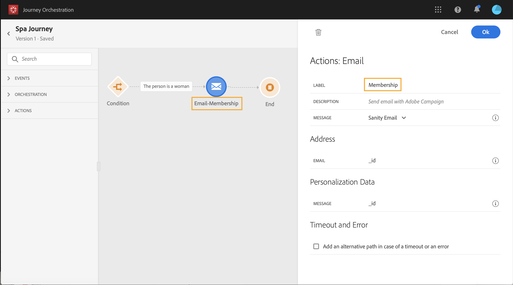

# Använda resedesignern {#concept_m1g_5qt_52b}

På hemmenyn för resan kan du visa **lista över resor**. Skapa en ny resa eller klicka på en befintlig för att öppna **resedesignerns gränssnitt**. Designern består av följande zoner: paletten, arbetsytan och aktivitetskonfigurationsrutan.

## Reselistan {#journey_list}

The **reselista** gör att du kan visa alla dina resor samtidigt, se deras status och utföra grundläggande åtgärder. Du kan skapa dubbletter, stoppa eller radera dina resor. Beroende på resan kanske vissa åtgärder inte är tillgängliga. Du kan till exempel inte radera eller starta om en resa som är stängd. Du kan skapa en ny version från den, duplicera den eller stoppa den. Du kan också använda sökfältet för att söka efter en resa.

Du kommer åt **[!UICONTROL Filters]** genom att klicka på filterikonen högst upp till vänster i listan. Med filtermenyn kan du filtrera de visade resorna enligt olika villkor (status, de som du skapade, de som ändrades under de senaste 30 dagarna, endast de senaste versionerna osv.). Du kan också välja att endast visa resor som använder en viss händelse, fältgrupp eller åtgärd. Kolumner som visas i listan kan konfigureras. Alla filter och kolumner sparas per användare.

Alla versioner av dina resor visas i listan med versionsnumret. Läs [den här sidan](../building-journeys/journey-versions.md).

>[!NOTE]
>
>Om du vill öppna arbetsytan för en resa på en annan flik i webbläsaren håller du ned **Kontroll** eller **Kommando** och klicka på resan.

## Paletten {#palette}

The **palett** finns till vänster på skärmen. Alla tillgängliga aktiviteter är sorterade i flera kategorier: **[!UICONTROL Events]**, **[!UICONTROL Orchestration]** och **[!UICONTROL Actions]**. Du kan expandera/komprimera de olika kategorierna genom att klicka på deras namn. Om du vill använda en aktivitet på din resa drar och släpper du den från paletten till arbetsytan. Du kan också dubbelklicka på en aktivitet på paletten för att lägga till den på arbetsytan i nästa steg. Du måste konfigurera varje aktivitet som läggs till från paletten innan du publicerar resan. Om du släpper en aktivitet på arbetsytan och inte slutför konfigurationen, stannar den kvar på arbetsytan, men en röd varning anger att konfigurationen inte har slutförts för den här aktiviteten.

>[!NOTE]
>
>Observera att det finns regler när en resa konfigureras. Otillåten konfiguration ignoreras. Du kan till exempel inte placera åtgärder parallellt, länka en aktivitet till ett tidigare steg för att skapa en slinga, starta en resa med något annat än en händelse, osv.

The **[!UICONTROL Filter items]** -ikonen i det övre vänstra hörnet kan du visa följande filter:

* **Visa endast tillgängliga objekt**: dölja eller visa otillgängliga element på paletten, t.ex. händelser som använder ett annat namnutrymme än de som används under din resa. Som standard är otillgängliga objekt dolda. Om du väljer att visa dem visas de som nedtonade.

* **Visa endast senaste objekt**: Med det här filtret kan du bara visa de fem senast använda händelserna och åtgärderna, förutom de som är färdiga. Detta är specifikt för varje användare. Som standard visas alla objekt.

Du kan också använda **[!UICONTROL Search]** fält. Endast händelser och åtgärder filtreras.

## Arbetsytan {#canvas}

The **arbetsyta** är den centrala zonen i resedesignern. Det är i den här zonen som du kan släppa dina aktiviteter och konfigurera dem. Klicka på en aktivitet på arbetsytan för att konfigurera den. Aktivitetskonfigurationsrutan öppnas till höger. Du kan zooma in och ut genom att använda knapparna &quot;+&quot; och &quot;-&quot; högst upp till höger. På arbetsytan kan du lägga till ett steg efter dem, förutom **[!UICONTROL End]** aktiviteter (se [den här sidan](../building-journeys/end-activity.md)).

## Åtgärdskonfigurationsfönstret {#configuration_pane}

The **aktivitetskonfigurationsruta** visas när du klickar på en aktivitet på paletten. Fyll i de obligatoriska fälten. Klicka på **[!UICONTROL Delete]** -ikonen för att ta bort aktiviteten. Klicka på **[!UICONTROL Cancel]** för att avbryta ändringarna eller **[!UICONTROL Ok]** för att bekräfta. Om du vill ta bort aktiviteter kan du även markera en aktivitet (eller flera) och trycka på backstegstangenten. Om du trycker på Esc stängs aktivitetskonfigurationsrutan.

På arbetsytan representeras dina åtgärder och händelseaktiviteter av en ikon med namnet på händelsen eller åtgärden som visas under. I aktivitetskonfigurationsrutan kan du använda **[!UICONTROL Label]** fält för att lägga till ett suffix till aktivitetsnamnet. Dessa etiketter hjälper dig att kontextualisera användningen av händelser och åtgärder, särskilt när du använder samma händelse eller åtgärd flera gånger under resan. Du kan också se etiketterna som du har lagt till i [!DNL Journey Orchestration] rapportering. Du kan också definiera etiketter för dina villkorsaktiviteter.

Som standard är skrivskyddade fält dolda. Om du vill visa skrivskyddade fält klickar du på **Visa skrivskyddade fält** ikonen längst upp till vänster i aktivitetskonfigurationsrutan. Denna inställning gäller alla aktiviteter på alla resor.

## Åtgärder i det övre fältet {#top_actions}

Beroende på resans status kan du utföra olika åtgärder under resan med hjälp av knapparna i det övre högra hörnet: **[!UICONTROL Publish]**, **[!UICONTROL Duplicate]**, **[!UICONTROL Delete]**, **[!UICONTROL Journey properties]**, **[!UICONTROL Test]**. De här knapparna visas när ingen aktivitet är markerad. Vissa knappar visas i sitt sammanhang. Loggknappen för testläget visas när testläget är aktiverat (se [den här sidan](../building-journeys/testing-the-journey.md)). Rapporteringsknappen visas när resan är live, stoppad eller stängd.

## Användning av banor på arbetsytan {#paths}

Flera verksamheter (**[!UICONTROL Condition]**, **[!UICONTROL Action]** aktiviteter) kan du definiera en reservåtgärd om ett fel eller en timeout inträffar. Markera kryssrutan i aktivitetskonfigurationsrutan: **[!UICONTROL Add an alternative path in case of a timeout or an error]**. En annan sökväg läggs till efter aktiviteten. Tidsgränsen definieras i resans egenskaper (se [den här sidan](../building-journeys/changing-properties.md) av en administratörsanvändare. Om det t.ex. tar för lång tid att skicka ett e-postmeddelande eller om det är fel, kan du bestämma dig för att skicka ett SMS.

Med olika aktiviteter (händelse, åtgärd, vänta) kan du lägga till flera sökvägar efter dem. Placera markören på aktiviteten och klicka på plustecknet (+). Endast händelse- och vänteaktiviteter kan anges parallellt. Om flera händelser anges parallellt är den valda sökvägen den första händelsen som inträffar.

När du lyssnar på en händelse rekommenderar vi att du inte väntar på händelsen i oändlighet. Det är inte obligatoriskt, bara en god praxis. Om du bara vill lyssna på en eller flera händelser under en viss tid, placerar du en eller flera händelser och en vänteaktivitet parallellt. Se [det här avsnittet](../building-journeys/event-activities.md#section_vxv_h25_pgb).

Om du vill ta bort banan placerar du markören på den och klickar på **[!UICONTROL Delete arrow]** ikon.

När två aktiviteter inte är kopplade till arbetsytan visas en varning. Placera markören på varningsikonen för att visa felmeddelandet. Åtgärda problemet genom att flytta den frånkopplade aktiviteten och koppla den till föregående aktivitet.

## Kopierings- och inklistringsaktiviteter {#copy-paste}

Du kan kopiera en eller flera aktiviteter under en resa och klistra in dem antingen under samma resa eller under en annan. På så sätt kan du spara tid om du vill återanvända flera aktiviteter som redan har konfigurerats under en tidigare resa.

**Viktiga anteckningar**

* Du kan kopiera/klistra in mellan olika flikar och webbläsare. Du kan bara kopiera/klistra in aktiviteter i samma instans.
* Du kan inte kopiera/klistra in en händelse om målresan innehåller en händelse som använder ett annat namnutrymme.
* Inklistrade aktiviteter kan referera till data som inte finns i målresan, till exempel om du kopierar/klistrar in mellan olika sandlådor. Sök alltid efter fel och gör nödvändiga justeringar.
* Tänk på att du inte kan ångra en åtgärd. Om du vill ta bort inklistrade aktiviteter måste du markera och ta bort dem. Se därför till att du bara väljer de aktiviteter du behöver innan du kopierar dem.
* Du kan kopiera aktiviteter från vilken resa som helst, även de som är skrivskyddade.
* Du kan välja vilken aktivitet som helst, även en aktivitet som inte är länkad. Länkade aktiviteter förblir länkade när de har klistrats in.

Så här kopierar/klistrar du in aktiviteter:

1. Öppna en resa.
1. Välj de aktiviteter du vill kopiera genom att flytta musen medan du klickar. Du kan också klicka på varje aktivitet samtidigt som du trycker på **Ctrl/Kommando** nyckel. Använd **Ctrl/Kommando + A** om du vill markera alla aktiviteter.
   
1. Tryck **Ctrl/Kommando + C**.
Om du bara vill kopiera en aktivitet kan du klicka på den och använda **Kopiera** ikonen i det övre vänstra hörnet i aktivitetskonfigurationsfönstret.
   
1. Under alla resor, tryck **Ctrl/Kommando + V** om du vill klistra in aktiviteterna utan att länka dem till en befintlig nod. Inklistrade aktiviteter placeras i samma ordning. När du har klistrat in aktiviteter förblir de markerade så att du enkelt kan flytta dem. Du kan också placera markören på en tom platshållare och trycka på **Ctrl/Kommando + V**. Inklistrade aktiviteter länkas till noden.
   
