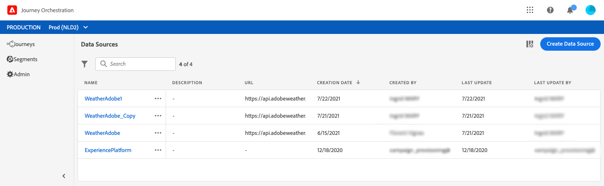

# Om datakällor {#concept_s1s_dqt_52b}

>[!CONTEXTUALHELP]
>id=&quot;jo_datasources&quot;
>title=&quot;Om datakällor&quot;
>abstract=&quot;Datakällans konfiguration utförs alltid av en teknisk användare. Med datakällkonfigurationen kan du definiera en anslutning till ett system för att hämta ytterligare information som ska användas i dina resor, till exempel: villkorsdefinition, parameter- och personaliseringsdata i funktionsmakron, anpassad väntedefinition, anpassad tidszonsdefinition.&quot;

Datakällans konfiguration utförs alltid av en **teknisk användare**.

Med datakällkonfigurationen kan du definiera en anslutning till ett system för att hämta ytterligare information som ska användas i dina resor, till exempel:

* villkorsdefinition
* parametrar och personaliseringsdata i åtgärder
* egen väntedefinition
* anpassad tidszonsdefinition

Den här konfigurationen krävs inte om dina resor endast utnyttjar lokala data som kommer från en händelsenyttolast. Om din resa till exempel består av en händelse som följs av en e-postaktivitet som bara använder data från händelsen behöver du inte konfigurera någon datakälla.

Det finns två typer av datakällor:

* Den förkonfigurerade Experience Platform-datakälla som definierar anslutningen till kundprofiltjänsten i realtid. Detta är en inbyggd datakälla. Se .
* De externa datakällor som gör att du kan definiera en anslutning till externa system. Det här är de du kan skapa. Se .

För varje datakälla definierar du den information som ska hämtas med fältgrupper. Se .

Här följer de huvudsakliga konfigurationsstegen för datakällor:

1. Klicka på **[!UICONTROL Data Sources]**fliken i den övre menyn.

   Listan med datakällor visas. Mer information om gränssnittet finns  i.

   

1. Sedan kan du antingen lägga till fältgrupper i den inbyggda datakällan (se ) eller skapa en ny extern datakälla (se ) och associerade fältgrupper (se ).

   

1. Klicka **[!UICONTROL Save]**.

   Datakällan är nu konfigurerad och klar att användas på dina resor.
