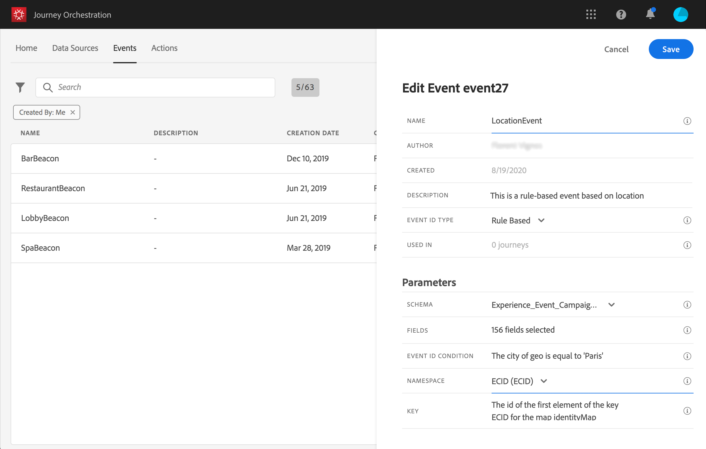

# Om händelser {#concept_gfj_fqt_52b}

>[!CONTEXTUALHELP]
>id="jo_events"
>title="Om händelser"
>abstract="En händelse är länkad till en person. Det rör en persons beteende (t.ex. en person som köpt en produkt, besökt en butik, lämnat en webbplats) eller något som händer med en person (en person har till exempel nått 10 000 poäng för lojalitet). Det här är vad Journey Orchestration kommer att lyssna på på resor för att samordna de bästa nästa åtgärderna."

En händelse är länkad till en person. Det rör en persons beteende (t.ex. en person som köpt en produkt, besökt en butik, lämnat en webbplats) eller något som händer med en person (en person har till exempel nått 10 000 poäng för lojalitet). Det här är vad Journey Orchestration kommer att lyssna på på resor för att samordna de bästa nästa åtgärderna.

Den här konfigurationen är **obligatorisk** eftersom resan är utformad för att lyssna på händelser och alltid utförs av en **teknisk användare**.

Med händelsekonfigurationen kan du definiera den information som Journey Orchestration ska ta emot som händelser. Du kan använda flera händelser (i olika steg på en resa) och flera resor kan använda samma händelse.

Om du redigerar en händelse som används i ett utkast eller en direktresa kan du bara ändra namn, beskrivning eller lägga till nyttolastfält. Vi begränsar strängt utgåvan av utkast- eller direktresor för att undvika att turer avbryts.

## Allmän princip {#section_r1f_xqt_pgb}

Händelser är POST API-anrop. Händelser skickas till Adobe Experience Cloud-dataplattformen via API:er för direktuppspelning. URL-destinationen för händelser som skickas via API:er för transaktionsmeddelanden kallas för ett &quot;inlet&quot;. Nyttolasten för händelser följer XDM-formatering.

Nyttolasten innehåller den information som krävs för att Streaming Ingakes API:er ska fungera (i huvudet) och den information som krävs för att Journey Orchestration ska fungera (händelse-ID:t, en del av nyttolastkroppen) och den information som ska användas på resor (i kroppen, till exempel mängden en övergiven vagn). Det finns två lägen för direktuppspelningsinmatning, autentiserad och oautentiserad. Mer information om API:er för direktuppspelning av inmatning finns på [den här länken](https://docs.adobe.com/content/help/en/experience-platform/xdm/api/getting-started.html).

Efter att ha anlänt via API:er för direktuppspelning av inmatning flödar händelserna till en intern tjänst som kallas Pipeline och sedan i Data Platform. Om händelseschemat har flaggan Kundprofiltjänst i realtid aktiverad och ett datauppsättnings-ID som även har flaggan Kundprofil i realtid, flödar det in i kundprofiltjänsten i realtid.

Pipelinen filtrerar händelser som har en nyttolast som innehåller händelse-ID:n för resan (se händelseskapandet nedan) som tillhandahålls av resan Orchestration och som ingår i händelsens nyttolast. Dessa händelser avlyssnas av Journey Orchestration och motsvarande resa utlöses.

## Skapa en ny händelse {#section_tbk_5qt_pgb}

Här följer de viktigaste stegen för att konfigurera en ny händelse:

1. Klicka på fliken på den översta menyn **[!UICONTROL Events]** . Listan med händelser visas. Mer information om gränssnittet finns  i.

   

1. Klicka **[!UICONTROL Add]** för att skapa en ny händelse. Händelsekonfigurationsfönstret öppnas till höger på skärmen.

   

1. Ange ett namn för händelsen.

   >[!NOTE]
   >
   >Använd inte blanksteg eller specialtecken. Använd inte fler än 30 tecken.

1. Lägg till en beskrivning till evenemanget. Det här steget är valfritt.
1. Definiera schema- och nyttolastfälten: Här väljer du händelseinformationen (kallas vanligtvis nyttolast) som reseorganisationen förväntar sig att ta emot. Du kan sedan använda den här informationen under din resa. Se .
1. Antalet resor som använder den här händelsen visas i **[!UICONTROL Used in]** fältet. Du kan klicka på **[!UICONTROL View journeys]** ikonen för att visa en lista över resor som använder den här händelsen.
1. Lägg till ett namnutrymme. Det här steget är valfritt, men rekommenderas eftersom du kan lägga till ett namnutrymme så att du kan utnyttja information som lagras i kundprofiltjänsten i realtid. Den definierar vilken typ av nyckel händelsen har. Se .
1. Definiera nyckeln: Välj ett fält från dina nyttolastfält eller definiera en formel för att identifiera den person som är associerad med händelsen. Den här nyckeln konfigureras automatiskt (men kan fortfarande redigeras) om du väljer ett namnutrymme. Journey Orchestration väljer nyckeln som ska motsvara namnutrymmet (om du till exempel väljer ett e-postnamnutrymme markeras e-postnyckeln). Se .
1. Lägg till ett villkor. Det här steget är valfritt. På så sätt kan systemet endast bearbeta händelser som uppfyller villkoret. Villkoret kan bara baseras på information som finns i händelsen. Se .
1. Klicka på **[!UICONTROL Save]**.

   

   Händelsen är nu konfigurerad och klar att släppas på en resa. Ytterligare konfigurationssteg krävs för att ta emot händelser. Se .
