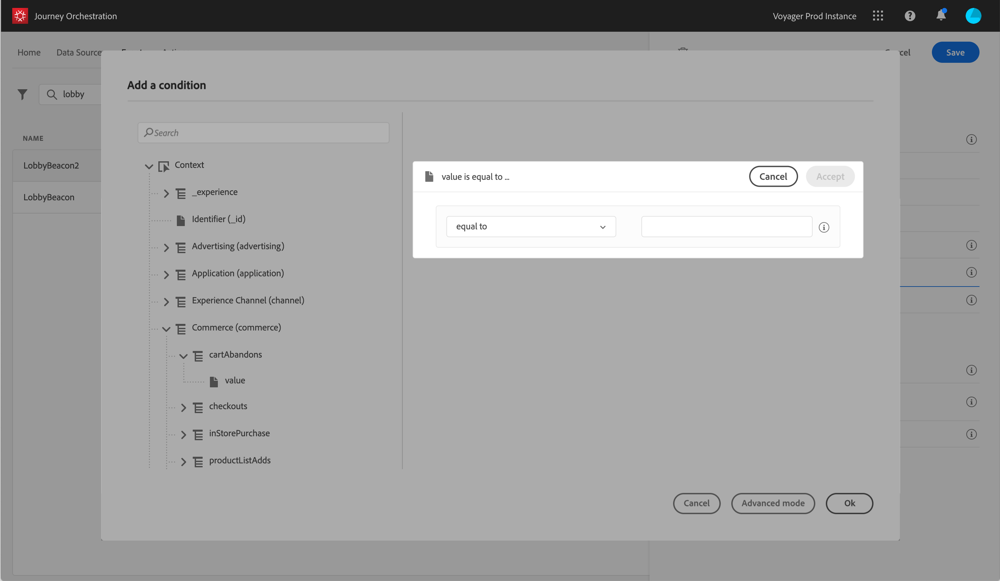

# Lägga till ett villkor {#concept_rbg_gqt_52b}

Händelsevillkoret gör att systemet kan filtrera händelsebearbetningen. Om villkoret är sant bearbetas händelsen. Om villkoret inte är true ignoreras händelsen.

Villkoret för händelser kan bara baseras på data som skickas i händelsens nyttolast. Villkoret som definieras på händelsenivå kan inte ändras på arbetsytan av en markör. Syftet är att förhöja det här villkoret när den här händelsen används. Om du till exempel aldrig vill att marknadsförarna ska använda kundvagnsöverlämningshändelser om kundvagnsvärdet är för litet, kan du skapa ett villkor i fältet &quot;kundvagnsvärde&quot; och ange ett värde över 100 dollar.

Du kan använda den enkla uttrycksredigeraren eller den avancerade uttrycksredigeraren för att ställa in villkor för händelser. Se .

Du kan till exempel definiera ett villkor så att endast händelser av en viss händelsetyp bearbetas och ignorera de andra typerna. Eller om din händelse är en vagnsöverlåtelse och nyttolasten innehåller fältet för kundvagnsvärde, kan du definiera ett händelsevillkor för att bearbeta händelserna endast om kundvagnsvärdet är större än 100 dollar.

