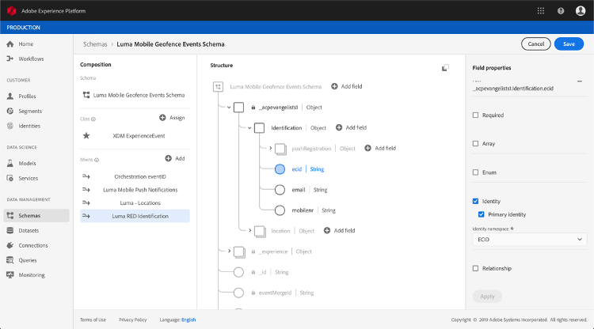
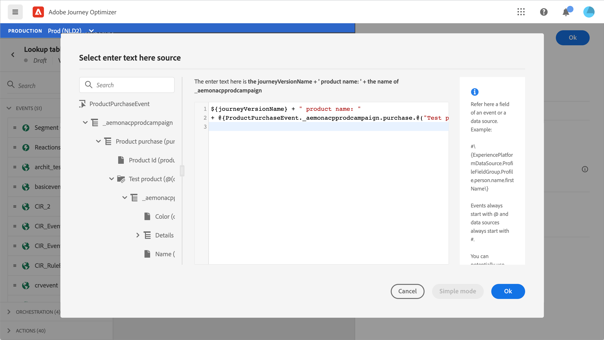

# Om ExperienceEvent-scheman för [!DNL Journey Orchestration]-händelser

>[!CAUTION]
>
>**Söker du Adobe Journey Optimizer**? Klicka [här](https://experienceleague.adobe.com/sv/docs/journey-optimizer/using/ajo-home) för Journey Optimizer-dokumentation.
>
>
>_Den här dokumentationen hänvisar till äldre Journey Orchestration-material som har ersatts av Journey Optimizer. Kontakta ditt kontoteam om du har frågor om din åtkomst till Journey Orchestration eller Journey Optimizer._

[!DNL Journey Orchestration] händelser är XDM Experience Events som skickas till Adobe Experience Platform via Streaming Ingtake.

En viktig förutsättning för att du ska kunna konfigurera händelser för [!DNL Journey Orchestration] är att du känner till Adobe Experience Platform Experience Data Model (eller XDM) och hur du skapar XDM Experience Event-scheman samt hur du direktuppspelar XDM-formaterade data till Adobe Experience Platform.

## Schemakrav för [!DNL Journey Orchestration]-händelser

Det första steget i att konfigurera en händelse för [!DNL Journey Orchestration] är att se till att du har ett definierat XDM-schema som representerar händelsen och en datauppsättning som skapats för att registrera instanser av händelsen på Adobe Experience Platform. Det är inte absolut nödvändigt att ha en datauppsättning för dina händelser, men om du skickar händelserna till en viss datauppsättning kan du behålla användarens händelsehistorik för framtida referens och analys, så det är alltid en bra idé. Om du inte redan har ett lämpligt schema och datamängd för händelsen kan båda dessa åtgärder utföras i Adobe Experience Platform webbgränssnitt.

Alla XDM-scheman som används för [!DNL Journey Orchestration]-händelser ska uppfylla följande krav:

* Schemat måste vara av klassen XDM ExperienceEvent.

  

* För systemgenererade händelser måste schemat innehålla Orchestration-händelseID-mixin. [!DNL Journey Orchestration] använder det här fältet för att identifiera händelser som används i resor.

  

* Deklarera ett identitetsfält för att identifiera föremålet för händelsen. Om ingen identitet anges kan en identitetskarta användas. Detta rekommenderas inte.

  

* Om du vill att dessa data ska vara tillgängliga för sökning senare i en resa markerar du schemat och datauppsättningen för profil.

  

  

* Du kan inkludera datafält för att samla in andra kontextdata som du vill inkludera med händelsen, till exempel information om användaren, enheten som händelsen genererades från, plats eller andra meningsfulla omständigheter som rör händelsen.

  

  

## Utnyttja schemarelationer{#leverage_schema_relationships}

Med Adobe Experience Platform kan du definiera relationer mellan scheman för att kunna använda en datauppsättning som en uppslagstabell för en annan.

Låt oss säga att er varumärkesdatamodell har ett schema som fångar upp inköp. Du har också ett schema för produktkatalogen. Du kan hämta produkt-ID:t i inköpsschemat och använda en relation för att söka efter mer fullständig produktinformation från produktkatalogen. Detta gör att du kan skapa ett segment för alla kunder som köpte en bärbar dator, till exempel, utan att behöva göra en explicit lista över alla bärbara ID:n eller hämta alla produktdetaljer i transaktionssystem.

Om du vill definiera en relation måste du ha ett dedikerat fält i källschemat, i det här fallet produkt-ID-fältet i inköpsschemat. Det här fältet måste referera till produkt-ID-fältet i målschemat. Käll- och måltabellerna måste vara aktiverade för profiler och målschemat måste ha det gemensamma fältet definierat som sin primära identitet.

Här är produktkatalogschemat aktiverat för profilen med produkt-ID definierat som primär identitet.

Här är inköpsschemat med relationen definierad i produkt-ID-fältet.

>[!NOTE]
>
>Läs mer om schemarelationer i [Experience Platform-dokumentationen](https://experienceleague.adobe.com/docs/platform-learn/tutorials/schemas/configure-relationships-between-schemas.html?lang=sv-SE).

I Journey Orchestration kan du sedan använda alla fält från de länkade tabellerna:

* när en enhetshändelse konfigureras, [Läs mer](../event/experience-event-schema.md#unitary_event_configuration)
* [Läs mer](../event/experience-event-schema.md#journey_conditions_using_event_context) när villkor används i en resa
* i anpassad åtgärdspersonalisering, [Läs mer](../event/experience-event-schema.md#custom_action_personalization_with_journey_event_context)

### Konfiguration av Unitary-händelse{#unitary_event_configuration}

De länkade schemafälten är tillgängliga i en händelsekonfiguration:

* när du bläddrar genom händelseschemafälten på händelsens konfigurationsskärm.
* när du definierar ett villkor för systemgenererade händelser.

De länkade fälten är inte tillgängliga:

* i händelsenyckelformeln
* händelse-id-villkor (regelbaserade händelser)

Mer information om hur du konfigurerar en enhetshändelse finns på [sidan](../event/about-creating.md).

### Resevillkor med händelsetyp{#journey_conditions_using_event_context}

Du kan använda data från en uppslagstabell som är länkad till en händelse som används i en resa för villkorsuppbyggnad (uttrycksredigeraren).

Lägg till ett villkor i en resa, redigera uttrycket och visa händelsnoden i uttrycksredigeraren.

Mer information om hur du definierar resevillkor finns på [sidan](../building-journeys/condition-activity.md).

### Åtgärdspersonalisering med reseventsammanhang{#custom_action_personalization_with_journey_event_context}

De länkade fälten är tillgängliga när åtgärdsparametrarna för en reseåtgärdsaktivitet konfigureras.

Mer information om hur du använder anpassade åtgärder finns på [sidan](../building-journeys/using-custom-actions.md).

