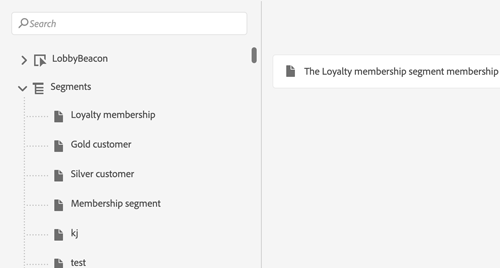
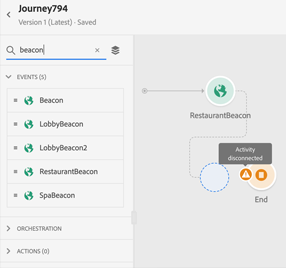

# Versionsinformation {#release-notes}

På den här sidan listas alla nya funktioner och förbättringar i Journey Orchestration.
Du kan även läsa [dokumentationsuppdateringarna](../release-notes/documentation-updates.md).

## November 2020-utgåvan {#november-release}

<table>
<thead>
<tr>
<th><strong>Hoppa från en resa till en annan</strong> </th>
</tr>
</thead>
<tbody>
<tr>
<td>

Vi har lagt till en ny åtgärdsaktivitet som gör att ni kan föra personer från en resa till en annan. Med hoppaktiviteten kan du:

<ul>
<li>förenkla utformningen av mycket komplexa resor genom att dela upp dem i flera. </li>
<li>bygga resor baserat på gemensamma och återanvändbara resemönster</li>
</ul>

Mer information finns i den <a href="../building-journeys/jump.md">detaljerade dokumentationen</a>.

</td>
</tr>
</tbody>
</table>

<table>
<thead>
<tr>
<th><strong>Använda reseegenskaper i uttrycksredigeraren</strong> </th>
</tr>
</thead>
<tbody>
<tr>
<td>

I den avancerade uttrycksredigeraren har vi lagt till en ny kategori i listan med fält och funktioner. Det här är den information som hämtats av systemet från direktresor, till exempel rese-ID:t eller de specifika fel som påträffats. Då får ni fler möjligheter när ni bygger era resor. Du kan till exempel meddela tredjepartssystem om ett villkor eller en åtgärd innehåller fel.

Observera att den här funktionen kommer att vara tillgänglig de närmaste dagarna.

Mer information finns i den <a href="../expression/journey-properties.md">detaljerade dokumentationen</a>.

</td>
</tr>
</tbody>
</table>

<table>
<thead>
<tr>
<th><strong>Regelbaserade händelser (beta)</strong> </th>
</tr>
</thead>
<tbody>
<tr>
<td>

Vi har lagt till en ny metod för att enklare konfigurera dina händelser. Den här funktionen, som har testats bland ett begränsat antal kunder genom Alpha-programmet, är nu tillgänglig i Beta för alla kunder. Den här nya metoden kräver inte att ett eventID används. Den utvärderar om händelsen ska utlösas enligt ett villkor. Du kan fortfarande använda den befintliga metoden, som nu kallas"systemgenererad".

Observera att den här funktionen kommer att vara tillgänglig de närmaste dagarna.

Mer information finns i den <a href="../event/about-events.md">detaljerade dokumentationen</a>.

</td>
</tr>
</tbody>
</table>

### Andra förbättringar{#october-november}

Begränsningar har lagts till när nya versioner av en resa skapas. Dessa begränsningar förhindrar alltför stora förändringar i kundresan för att bibehålla en viss enhetlighet mellan versionerna. [Läs mer](../about/limitations.md#journey-versions-limitations)

Det går inte längre att använda aktiviteten **Segmentkvalificering** i en resa som innehåller meddelandeaktiviteter för Campaign Standarder. Den här begränsningen skyddar integriteten för Adobe Campaign Standard-instanser. Användningen av Segmentkvalificering kan faktiskt leda till dagliga toppar av meddelanden som skulle överbelasta Campaign Standarden Transactional Messaging. [Läs mer](../about/limitations.md#segment-qualification)

## Oktober 2020-utgåvan {#october-release}

<table>
<thead>
<tr>
<th><strong>Tidsgräns för händelse</strong> </th>
</tr>
</thead>
<tbody>
<tr>
<td>

Du kan nu konfigurera en timeout för en händelse för att få en resa att lyssna på en händelse endast under en viss tid. Du behöver inte längre lägga till en Vänta-aktivitet parallellt med händelsens sökväg för att uppnå detta.

Mer information finns i den <a href="../building-journeys/event-activities.md#listening-to-events-during-a-specific-time">detaljerade dokumentationen</a>.

</td>
</tr>
</tbody>
</table>

### Andra förbättringar{#october-other}

* När du publicerar en ny version av en resa avslutas den tidigare versionen automatiskt och ändras till statusen Stängd. [Läs mer](../building-journeys/journey-versions.md)

## September 2020-utgåvan {#september-release}

### GA-uppdateringar{#september-ga-update}

<table>
<thead>
<tr>
<th><strong>Förbättringar av villkorsaktivitet</strong> </th>
</tr>
</thead>
<tbody>
<tr>
<td>

När du lägger till villkor till din resa kan du nu definiera en etikett. Om du använder flera villkor under en resa kan du lättare identifiera dem.

Mer information finns i den <a href="../building-journeys/condition-activity.md#about_condition">detaljerade dokumentationen</a>.

</td>
</tr>
</tbody>
</table>

### Alfa-uppdateringar{#september-alpha-update}

Läs det här [avsnittet](../alpha/alpha-overview.md) för att upptäcka omfattningen om alfaversionen.

<table>
<thead>
<tr>
<th><strong>Förbättrad läsningssegmentaktivitet</strong> </th>
</tr>
</thead>
<tbody>
<tr>
<td>

Följande förbättringar har gjorts i aktiviteten <strong>Läs segment</strong>:

<ul>
<li>
Segmentbaserade resor visar nu, ovanför arbetsytan, en påminnelse om resans schematyp. Du kan klicka på den här påminnelsen för att komma åt schemakonfigurationsmenyn.

</li>
<li>
Detaljrikedomen i testlägesloggarna har förbättrats för att visa segmentets exportförloppsstatus.

</li>
</ul>

Mer information om aktiviteten <strong>Läs segment</strong> finns i <a href="../alpha/alpha-segment-trigger.md">den detaljerade dokumentationen</a>.

</td>
</tr>
</tbody>
</table>

## Versionen från augusti 2020 {#august-release}

### GA-uppdateringar{#august-ga-update}

Nyttolasten för segments kvalificeringshändelser innehåller nu följande sammanhangsinformation som du kan använda i villkor och åtgärder: beteendet (ingång, utgång), tidsstämpeln för kvalificeringen och segment-ID. [Läs mer](../building-journeys/segment-qualification-events.md)

### Alfa-uppdateringar{#august-alpha-update}

Läs det här [avsnittet](../alpha/alpha-overview.md) för att upptäcka omfattningen om alfaversionen.

<table>
<thead>
<tr>
<th><strong>Aktivitet för utlösare av segment</strong> </th>
</tr>
</thead>
<tbody>
<tr>
<td>

Följande förbättringar har gjorts i aktiviteten för utlösare av segment:

<ul>
<li>
Aktivitetens namn har ändrats till ”Läsa segment”. 

</li>
<li>
Konfigurationen av resans schemaläggare har tagits bort från aktivitetens egenskaper. Den är nu tillgänglig direkt från resans egenskaper i ett dedikerat avsnitt som visas om aktiviteten Läsa segment har placerats på arbetsytan. 

</li>
<li>
Du kan nu testa resan med en enhetlig profil och följa förloppet i den med hjälp av det visuella flödet.

</li>
</ul>

Mer information finns i den <a href="../alpha/alpha-segment-trigger.md">detaljerade dokumentationen</a>.

</td>
</tr>
</tbody>
</table>

<table>
<thead>
<tr>
<th><strong>Regelbaserade händelser</strong> </th>
</tr>
</thead>
<tbody>
<tr>
<td>

Följande förbättringar har gjorts i regelbaserade händelser:

<ul>
<li>
Du kan nu utnyttja alla händelsedata från beteenden i Adobe Analytics som du redan samlar in och strömmar till plattformen för att utlösa resor och automatisera kundernas upplevelser. <a href="../event/about-analytics.md">Läs mer</a>

</li>
<li>
När du utlöser en regelbaserad händelse i testläget kan du nu direkt se villkorets händelse-ID. Dessutom har ett verktygstips lagts till bredvid varje fält som en del av regelutvärderingen. <a href="../building-journeys/testing-the-journey.md#test-rule-based">Läs mer</a>

</li>
<li>
Den regelbaserade skärmen för händelsedefinition har omorganiserats för att leverera en bättre upplevelse. <a href="../event/about-creating.md">Läs mer</a>

</li>
</ul>
</td>
</tr>
</tbody>
</table>

## Alfaaversion – juli 2020 {#alpha-release---july-2020}

Programmets alfaversion har funktioner som för närvarande testas bland ett begränsat antal kunder. På så sätt kan vi förbättra vår produkt baserat på den feedback vi får. De här funktionerna är inte tillgängliga för alla kunder som använder Journey Orchestration.

De här funktionerna beskrivs i ett dedikerat [avsnitt](../alpha/alpha-overview.md).

<table>
<thead>
<tr>
<th><strong>Förbättrat användargränssnitt</strong> </th>
</tr>
</thead>
<tbody>
<tr>
<td>

Navigeringen bland menyerna i Journey Orchestration har förbättrats så att gränssnittet med Adobe Experience Platform blir konsekvent:

<ul>
<li>
Menyer har flyttats från den övre delen till den vänstra sidan av gränssnittet. 

</li>
<li>
Gruppering av administratörsfunktioner i en enda kontrollpanel.

</li>
</ul>

Mer information finns i den <a href="../alpha/alpha-interface.md">detaljerade dokumentationen</a>.

</td>
</tr>
</tbody>
</table>

<table>
<thead>
<tr>
<th><strong>Aktivitet för utlösare av segment</strong> </th>
</tr>
</thead>
<tbody>
<tr>
<td>

Med aktiviteten för utlösare av segment kan du placera alla personer, som tillhör ett segment i Adobe Experience Platform, i en resa. Inträde i en resa kan genomföras antingen en gång eller regelbundet. <a href="../alpha/alpha-segment-trigger.md">Läs mer</a>

</td>
</tr>
</tbody>
</table>

<table>
<thead>
<tr>
<th><strong>Regelbaserade händelser</strong> </th>
</tr>
</thead>
<tbody>
<tr>
<td>

Vi har förenklat hur du konfigurerar upplevelsehändelser. Vi introducerar en ny metod som inte kräver att ett händelse-ID används. När du konfigurerar en händelse i Journey Orchestration kan du nu definiera en regelbaserad händelse. <a href="../event/about-events.md">Läs mer</a>

</td>
</tr>
</tbody>
</table>

## Utgåvan kvartal 2 – juni 2020 {#q2-release---june-2020}

<table>
<thead>
<tr>
<th><strong>Förbättrad integrering med Adobe Experience Platform</strong> </th>
</tr>
</thead>
<tbody>
<tr>
<td>

Följande förbättringar gällande integreringen i Adobe Experience Platform har gjorts:

<ul>
<li>
En ny aktivitet tillåter avläsning av ett segments ingångar/utgångar i Adobe Experience Platform för att få människor att komma in i eller gå framåt i en resa. <a href="../building-journeys/segment-qualification-events.md">Läs mer</a>

</li>
<li>
Segment i Adobe Experience Platform kan nu skapas och redigeras utan att man lämnar gränssnittet i Journey Orchestration tack vare en ny flik för <strong>segment</strong> . <a href="../segment/about-segments.md">Läs mer</a>

</li>
<li>
I den enkla uttrycksredigeraren visas nu segment i Adobe Experience Platform direkt i navigeringsträdet så att man enkelt kan konfigurera villkor såsom ”tillhör den här personen segment A?”. <a href="../segment/using-a-segment.md">Läs mer</a>

</li>
<li>
Journey Orchestration skickar nu automatiskt de steg som har körts i resorna till Adobe Experience Platform. Detta inkluderar potentiella fel som påträffas. Den här informationen kan användas när man vill utföra rapportering och felsökning genom att köra frågor om steg i resehändelser för en viss resa eller för alla resor. <a href="../building-journeys/sharing-overview.md">Läs mer</a>

</li>
<li>
Journey Orchestration kan nu anslutas till sandlådor i Adobe Experience Platform för produktion och icke-produktion. Observera att sandlådor är en betafunktion. <a href="../about/access-management.md#sandboxes">Läs mer</a>

</li>
</ul>
</td>
</tr>
</tbody>
</table>

<table>
<thead>
<tr>
<th><strong>Förbättringar av resedesignern och testläget</strong> </th>
</tr>
</thead>
<tbody>
<tr>
<td>

Följande förbättringar har gjorts för resedesignern och testläget:

<ul>
<li>
Du kan nu kopiera inklistringsaktiviteter från en resa till en annan och välja 1 eller N reseaktiviteter. <a href="../building-journeys/using-the-journey-designer.md#copy-paste">Läs mer</a>

</li>
<li>
När du har startat en händelse för att en testprofil ska komma in i en resa kan du nu se hur den fortskrider i resan tack vare ett färglagt visuellt flöde. Om det uppstår fel i resan visas även information om felen. <a href="../building-journeys/testing-the-journey.md#firing_events">Läs mer</a>

</li>
<li>Det <strong>slutförda</strong> resetillståndet har bytt namn till <strong>Stängd (ingen entré)</strong> för att bättre återspegla vad det här läget innebär.</li>
</ul>
</td>
</tr>
</tbody>
</table>

**Andra förbättringar**

För att undvika att för många API-anrop skickas till tredjepartssystem introducerar vi ett nytt offentligt API för att konfigurera &quot;begränsningsregler&quot;. Med begränsningsregler tillåts definitionen av ett maximalt antal anrop till en API-slutpunkt per millisekunder. [Läs mer](../api/capping.md)

Med åtkomstkontroll tillåts nu större detaljrikedom i åtkomsthantering av användare. Effektiv tillgänglighet: 30 juni 2020. [Läs mer](../about/access-management.md#create-product-profile)

Journey Orchestration är nu tillgängligt i APAC (Australiens datacenter). Effektiv tillgänglighet: 30 juni 2020

Gränssnittet i Journey Orchestration finns tillgängligt på japanska.

## Utgåvan kvartal 1 – mars 2020 {#q1-release---march-2020}

<table>
<thead>
<tr>
<th><strong>Förbättringar av testläget</strong> </th>
</tr>
</thead>
<tbody>
<tr>
<td>

Följande förbättringar har gjorts i testläget:

<ul>
<li>När en resa använder flera händelser kan du nu utlösa dem individuellt från en rullgardinsmeny på skärmen för <strong>händelsekonfiguration</strong> i testläget. <a href="../building-journeys/testing-the-journey.md#firing_events">Läs mer</a>
</li>
<li>
När en eller flera <strong>Vänta</strong>-aktiviteter används i en resa kan du nu definiera den tid som varje aktivitet ska vara i testläge. Den förinställda tiden är tio sekunder. Du kan ändra detta med parametern <strong>Väntetid i test</strong> i det nedre vänstra hörnet. <a href="../building-journeys/testing-the-journey.md">Läs mer</a>

</li>
<li>I <strong>testloggarna</strong> visas nu felkoden och felsvaret om ett fel uppstår när ett system från tredje part anropas (datakälla eller åtgärd). <a href="../building-journeys/testing-the-journey.md#viewing_logs">Läs mer</a>
</li>
</ul>
</td>
</tr>
</tbody>
</table>

<table>
<thead>
<tr>
<th><strong>Centraliserad hantering av tidszoner</strong> </th>
</tr>
</thead>
<tbody>
<tr> 
<td>

Hantering av tidszoner är nu centraliserad i panelen för reseegenskaper. Två parametrar har lagts till i resans egenskaper:

<ul>
<li>På rullgardinsmenyn <strong>Tidszon</strong> kan du välja en specifik tidszon. Som standard används webbläsarens tidszon. </li>
<li>I kryssrutan <strong>Tidszonsprofil</strong> kan du använda tidszonen från profilen i Adobe Experience Platform (om den är tillgänglig) för den person som påbörjar resan. Annars används den tidszon som definieras på rullgardinsmenyn. Den här funktionen är inte kompatibel med resor som använder händelser som saknar namnrymd.</li>
</ul>

Se avsnitten <a href="../building-journeys/changing-properties.md#timezone">Ändra egenskaper</a> och <a href="../building-journeys/timezone-management.md">Hantera tidszoner</a> för mer information.

</td>
</tr>
</tbody>
</table>

<table>
<thead>
<tr>
<th><strong>Förbättringar av resedesignern</strong> </th>
</tr>
</thead>
<tbody>
<tr> 
<td>

Resans <strong>palett</strong> till vänster om resedesignern har förbättrats:

<ul>
<li>Med en ny ikon bredvid <strong>sökfältet</strong> kan du dölja eller visa otillgängliga element på paletten såsom händelser som använder en annan namnrymd än de som används i din resa. Som standard är otillgängliga objekt dolda.</li>
<li>När du använder <strong>sökfältet</strong> visas nu antalet resultat för varje aktivitetskategori på arbetsytan.</li>
<li>Navigeringen mellan de olika aktivitetskategorierna har förbättrats.</li>
</ul>

I resedesignern kan du nu kontrollera att du har tillgång till den senaste versionen av resan. Den här informationen visas bredvid versionsnumret.

När två aktiviteter inte är kopplade till resans <strong>arbetsyta</strong> visas ett varningsmeddelande.

Se den <a href="../building-journeys/using-the-journey-designer.md">detaljerade dokumentationen</a> för mer information.

</td>
</tr>
</tbody>
</table>

<table>
<thead>
<tr>
<th><strong>Sammanhangsberoende hjälp</strong> </th>
</tr>
</thead>
<tbody>
<tr>
<td>

Nu finns det sammanhangsberoende hjälp för olika listskärmar i Journey Orchestration (resor, händelser, åtgärder och datakällor). Hjälpen innehåller en kort beskrivning av den aktuella funktionen och du får tillgång till relaterade artiklar och videor.

Klicka på ikonen  i skärmens övre högra hörn för att visa sammanhangsberoende hjälp. 

</td>
</tr>
</tbody>
</table>

**Andra förbättringar**

* Förutom i USA finns nu även Journey Orchestration tillgänglig i **EMEA**. Ansökan och dokumentationen finns tillgänglig på franska och tyska.

* Experience League är nu integrerad i produkten. Detta förenklar åtkomsten till relaterat innehåll och hjälper dig att få ut mesta möjliga av Experience Cloud. Direktåtkomst till dokumentationen om Journey Orchestration finns tillgänglig längst ned på hjälpfliken. Du kan dessutom klicka på Hjälp > Feedback för att rapportera problem eller dela med dig av dina idéer till Adobe.

* Tangentbordsgenvägen **C**, som du använder för att skapa en ny post, är nu tillgängligt på alla listskärmar såsom resor, datakällor, åtgärder och händelser. [Läs mer](../about/user-interface.md#section_ksq_zr1_ffb)

* Du kan nu **radera** avbrutna resor. Rapporter som är kopplade till dessa raderade resor är inte tillgängliga.

* När du bläddrar bland **datafälten i Adobe Experience Platform** (XDM-format) visas nu även visningsnamnet tillsammans med fältnamnet. Den här informationen hämtas från schemadefinitionen i upplevelsedatamodellen. Det alternativa visningsnamnet visas när det är tillgängligt. Med den här användarvänliga beskrivningen, som är särskilt användbar för eVar-fält, blir det enklare att identifiera fälten. [Läs mer](../about/user-interface.md#friendly-names-display)

## GA-utgåva – december 2019 {#ga-release---december-2019}

Journey Orchestration är nu GA.

Bygg en orkestrering i realtid med hjälp av kontextuella data lagrade i händelser eller datakällor.

Journey Orchestration möjliggör orkestrering i realtid som bygger på kontextuella data från händelser, information från Adobe Experience Platform eller data från API-tjänster från tredje part. I flöden med flera steg, som kallas för resor, fastställer programmet vilka som är bästa åtgärder för konsumenten utifrån hans/hennes profil och beteende. Detta omfattar både den optimala tidpunkten och typen av åtgärd. Sådana åtgärder kan vara att skicka ett push-meddelande till konsumenten via funktionen transaktionsmeddelanden i Adobe Campaign Standard (kräver Adobe Campaign Standard) eller ett meddelande från en tredje part. Dessa beslut fattas utifrån regler och Sensei-poäng.

[Läs mer](../action/working-with-adobe-campaign.md) om Journey Orchestration

Ytterligare resurser:

* [Självstudiekurser](https://docs.adobe.com/content/help/sv-SE/journey-orchestration-learn/tutorials/understanding-journey-orchestration.html)
* [Community](https://www.adobe.com/go/journeyorchestrationcommunity)
