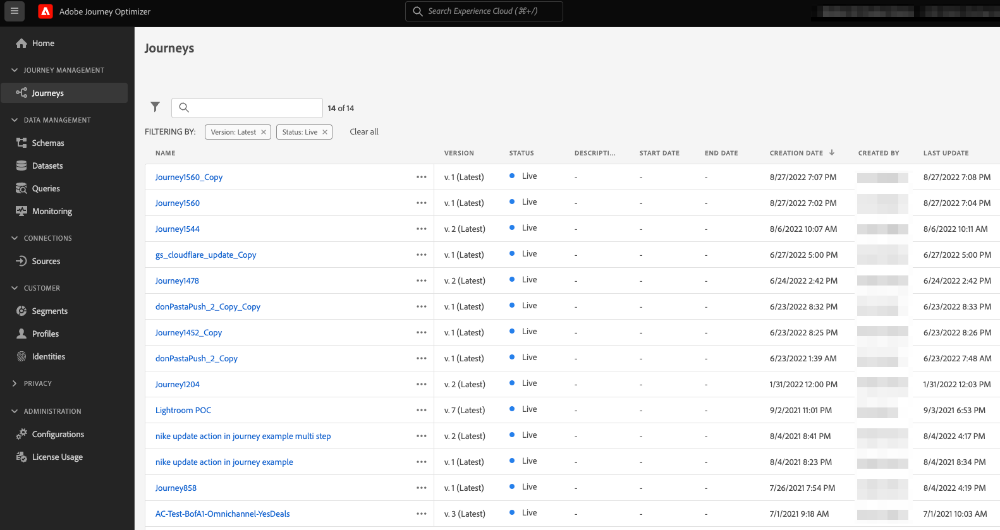

# Uppgradera din Journey Orchestration-miljö till Adobe Journey Optimizer{#ugrade-ajo}

## Vad är Adobe Journey Optimizer?

Adobe Journey Optimizer är en flexibel och skalbar tillämpning som bygger på Adobe Experience Platform för att organisera och leverera personaliserade, anslutna och vältajmade kundresor i alla appar, enheter, skärmar eller kanaler. &#x200B;

## Vad är Journey Orchestration?

Journey Orchestration är en tjänst som bygger på Adobe Experience Platform och som gör att ni kan skräddarsy enskilda kundresor utifrån deras tidigare beteenden och önskemål. Journey Orchestration är prekursorprogrammet för Journey Optimizer.

## Varför ska jag flytta till Adobe Journey Optimizer?

**Tillgång till ett smidigt gränssnitt** med funktioner i Experience Platform som ger snabb åtkomst till resor, datauppsättningar, profiler, varningar med mera. Du behöver inte längre växla fram och tillbaka mellan Adobe Experience Platform och Journey Orchestration för att få tillgång till scheman eller datauppsättningar. Allt är tillgängligt direkt från Adobe Journey Optimizer. Mer information finns i [page](https://experienceleague.adobe.com/docs/journey-optimizer/using/get-started/user-interface.html).

<table>
<tr>
<th>Före</th>
<th>Efter</th>
</tr>
<tr>
<td>
Tillgång till resorna, segmenten och administrationsavsnittet (datakällor, händelser och åtgärder) i Journey Orchestration. Segment och datauppsättningar är tillgängliga i Adobe Experience Platform. 
</td>
<td>
Tillgång till resor, segment, administration, segment och datauppsättningar. <strong>allt inom Adobe Journey Optimizer</strong>. <strong>Fler Adobe Experience Platform-funktioner</strong> finns också här.
</td>
</tr>
</table>

**Nytt rapporteringsgränssnitt** och tillgång till nya rapportfunktioner:

<table>
<tr>
<th>Före</th>
<th>Efter</th>
</tr>
<tr>
<td></td>
<td>
<strong>Global vy</strong> gör att du kan mäta effekten av dina resor och leveranser under en viss tidsperiod. Om du vill ha mer realtidsstatistik kan du använda <strong>Live-vy</strong>. För varje leveranskanal som används på dina resor (e-post, SMS, push), en <strong>dedikerad sektion</strong> finns i rapporten för att visa mätvärden. Detta gäller endast om du använder färdiga <strong>Adobe Journey Optimizer meddelandefunktioner</strong>. Kontakta ditt kontoteam om du vill ha mer information.
</td>
</tr>
</table>

Alla förändringar som kan förbättra rapportupplevelsen eller förbättra den efter nya funktioner är bara tillgängliga i det nya rapporteringsgränssnittet. Börja använda den för att få en mer komplett Adobe Journey Optimizer-upplevelse.

Utnyttja fördelarna med andra **Funktioner i Adobe Journey Optimizer** och nya som kommer ut som Åtkomstkontroll på fältnivå och Åtkomstkontroll på objektnivå. Kontakta ditt kontoteam för mer information.

## Hur uppgraderar jag Journey Orchestration?

1. Kontakta ert kontoteam för att uppdatera ert avtal med Adobe.

1. Vänta på att vårt konstruktörsteam ska slutföra ändringen.

1. Uppdatera dina behörigheter med Journey Optimizer produktprofiler. Se detta [page](https://experienceleague.adobe.com/docs/journey-optimizer/using/administration/ootb-product-profiles.html).

1. Nu har du tillgång till Adobe Journey Optimizer!

## Vanliga frågor

### Behöver jag planera något för att gå från Journey Orchestration till Adobe Journey Optimizer?

Nej, det finns ingen migrering, inget arbete krävs från dig, inget driftstopp och inga ytterligare investeringar. Du behöver bara uppdatera avtalet med Adobe och vi gör resten. Kontakta din kontorepresentant för att få anvisningar om hur du initierar processen.

### Kommer jag att förlora någonting efter ändringen?

Nej, du behåller alla dina befintliga Journey Orchestration- och Adobe Experience Platform-objekt: scheman, datauppsättningar, resor, händelser, datakällor, åtgärder. Ingenting kommer att gå förlorat, alla resor fortsätter att fungera utan avbrott.

<table>
<tr>
<th>Före</th>
<th>Efter</th>
</tr>
<tr>
<td></td>
<td></td>
</tr>
</table>

### Jag ser fortfarande Journey Orchestration i applikationsväljaren, är det normalt?

Ja, det är normalt. Du kan fortfarande se Journey Orchestration under några dagar efter uppgraderingen. Använd Journey Optimizer.

### Vad händer om jag använder Journey Orchestration med Adobe Campaign Standard idag?

Genom att gå över till Adobe Journey Optimizer kan du fortfarande använda integreringen mellan Journeys och Adobe Campaign Standard genom att designa din kundresa i Adobe Journey Optimizer och låta Adobe Campaign Standard skicka leveransen.

På grund av hur Adobe Journey Optimizer rapporteringsstackar fungerar kommer rapporteringen dock inte att kombinera data om resor och Campaign Standard. Reseinformationen finns i Adobe Journey Optimizer rapporter och leveransinformation i Adobe Campaign Standard. Du kan konfigurera Experience Platform för att hämta tillbaka Adobe Campaign Standard-data till Adobe Experience Platform och göra dem tillgängliga för Customer Journey Analytics ([läs mer](https://business.adobe.com/products/experience-platform/customer-journey-analytics.html)) eller andra rapporteringsverktyg från tredje part, som Tableau eller PowerBI.

Adobe Journey Optimizer rapporterar bäst om Adobe Journey Optimizer färdiga meddelandefunktioner används (finns i dedikerade Adobe Journey Optimizer-erbjudanden). Mer information om hur meddelanden kan redigeras på arbetsytan finns i [page](https://experienceleague.adobe.com/docs/journey-optimizer/using/messages/messages-in-journeys.html).

Kontakta ditt kontoteam om du vill ha mer information.
