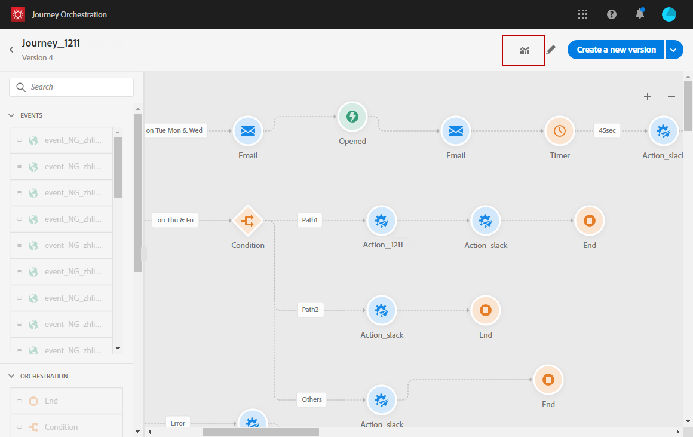
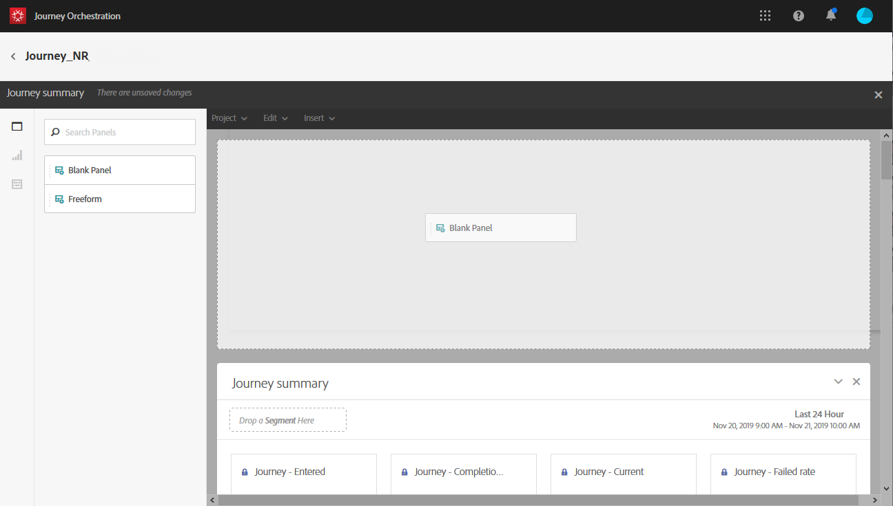
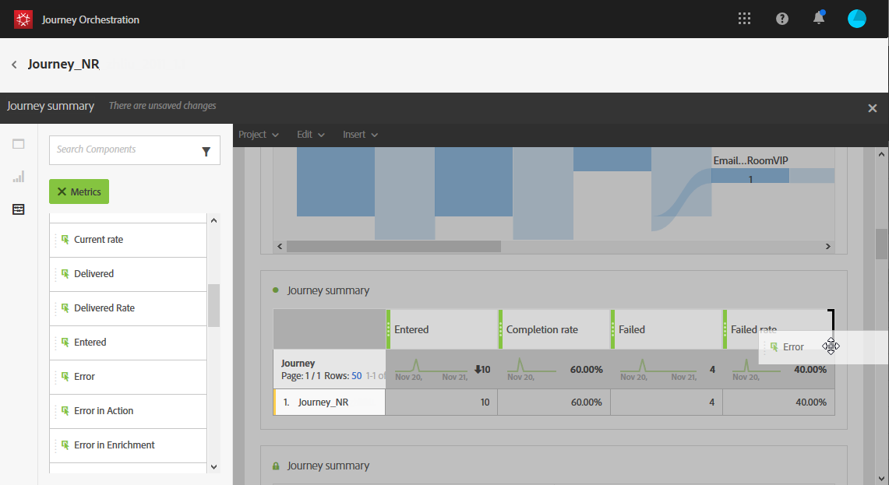
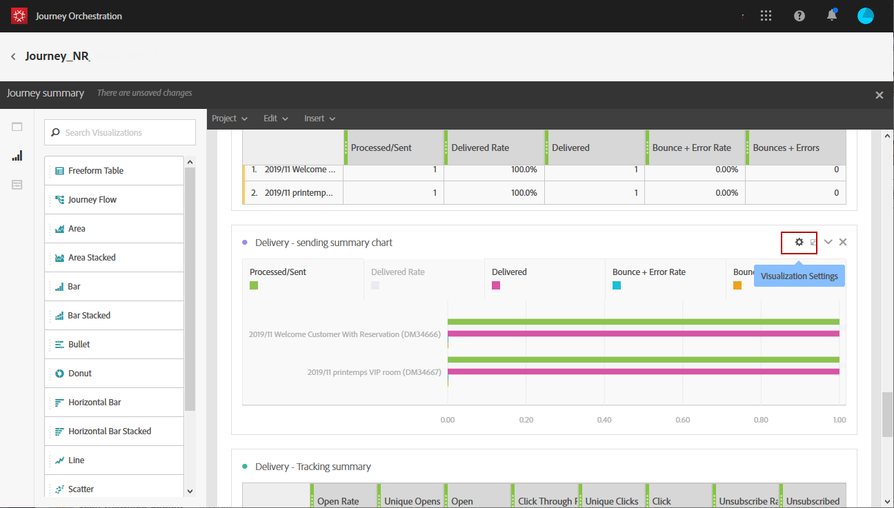

# Skapa reserapporter {#concept_rfj_wpt_52b}

## Få åtkomst till och skapa rapporter {#accessing-reports}

>[!NOTE]
>
>När du har tagit bort en resa är alla tillhörande rapporter inte längre tillgängliga.

I det här avsnittet beskrivs hur du skapar eller använder färdiga rapporter. Kombinera paneler, komponenter och visualiseringar för att bättre kunna spåra framgången i dina resor.

Så här får du tillgång till reserapporter och kan börja följa upp hur bra dina leveranser är:

1. Klicka på fliken **[!UICONTROL Home]** på den övre menyn.

1. Välj den resa som du vill rapportera om.

   Observera att du även kan komma åt dina rapporter genom att klicka på **Rapport** när du hovrar över en resa i listan över resor.

   

1. Klicka på ikonen **[!UICONTROL Report]** längst upp till höger på skärmen.

   

1. Rapporten **[!UICONTROL Journey summary]** visas inte på skärmen. Klicka på knappen **[!UICONTROL Close]** om du vill få åtkomst till anpassade rapporter.

   

1. Klicka på **[!UICONTROL Create new project]** för att skapa rapporten från grunden.

   

1. Dra och släpp så många paneler eller frihandstabeller som behövs från fliken **[!UICONTROL Panels]**. Mer information finns i det här [avsnittet](#adding-panels).

   

1. Du kan sedan börja filtrera dina data genom att dra och släppa mått och mätvärden från fliken **[!UICONTROL Components]** till frihandstabellen. Mer information finns i det här [avsnittet](#adding-components).

   

1. Om du vill få en tydligare bild av dina data kan du lägga till visualiseringar från fliken **[!UICONTROL Visualizations]**. Mer information finns i det här [avsnittet](#adding-visualizations).

## Lägga till paneler{#adding-panels}

### Lägga till en tom panel {#adding-a-blank-panel}

För att starta rapporten kan du lägga till en uppsättning paneler i en färdig eller anpassad rapport. Varje panel innehåller olika datauppsättningar och består av frihandstabeller och visualiseringar.

Med den här panelen kan du skapa rapporter efter behov. Du kan lägga till så många paneler du vill i dina rapporter för att filtrera data med olika tidsperioder.

1. Klicka på ikonen **[!UICONTROL Panels]**. Du kan också lägga till en panel genom att klicka på **[!UICONTROL Insert tab]** och välja **[!UICONTROL New Blank Panel]**.

   

1. Dra och släpp **[!UICONTROL Blank Panel]** på instrumentpanelen.

   

Nu kan du lägga till en friformstabell på panelen för att börja målinrikta data.

### Lägga till en frihandstabell {#adding-a-freeform-table}

Med frihandstabeller kan du skapa en tabell för att analysera dina data med hjälp av de olika mätvärden och dimensioner som är tillgängliga i tabellen **[!UICONTROL Component]**.

Det går att ändra storlek på alla tabeller och visualiseringar och de kan flyttas för att bättre anpassa rapporten.

1. Klicka på ikonen **[!UICONTROL Panels]**.

   

1. Dra och släpp **[!UICONTROL Freeform]**-objektet på instrumentpanelen.

   Du kan också lägga till en tabell genom att klicka på fliken **[!UICONTROL Insert]** och välja **[!UICONTROL New Freeform]** eller genom att klicka på **[!UICONTROL Add a freeform table]** i en tom panel.

   

1. Dra och släpp objekt från fliken **[!UICONTROL Components]** till kolumnerna och raderna för att skapa tabellen.

   

1. Klicka på ikonen **[!UICONTROL Settings]** om du vill ändra hur data visas i kolumnerna.

   

   **[!UICONTROL Column settings]** består av:

   * **[!UICONTROL Number]**: gör att du kan visa eller dölja sammanfattningsnummer i kolumnen.
   * **[!UICONTROL Percent]**: gör att du kan visa eller dölja procentsatser i kolumnen.
   * **[!UICONTROL Interpret zero as no value]**: gör att du kan visa eller dölja när värdet är lika med noll.
   * **[!UICONTROL Background]**: gör att du kan visa eller dölja den vågräta förloppsindikatorn i celler.
   * **[!UICONTROL Include retries]**: gör att du kan inkludera återförsök i resultatet. Detta är bara tillgängligt för **[!UICONTROL Sent]** och **[!UICONTROL Bounces + Errors]**.

1. Markera en eller flera rader och klicka på ikonen **[!UICONTROL Visualize]**. En visualisering läggs till för att återspegla de rader du har valt.

   

Nu kan du lägga till så många komponenter du behöver och även lägga till visualiseringar för att ge grafiska representationer av dina data.

## Lägga till komponenter{#adding-components}

Med komponenter kan du anpassa rapporter med olika dimensioner, mätvärden och tidsperioder.

1. Klicka på fliken **[!UICONTROL Components]** för att komma åt komponentlistan.

   

1. Varje kategori som visas på fliken **[!UICONTROL Components]** visar de fem mest använda objekten. Klicka på namnet på en kategori för att få tillgång till dess fullständiga lista över komponenter.

   Komponenttabellen är uppdelad i tre kategorier:

   * **[!UICONTROL Dimensions]**: Hämta information från leveransloggen, till exempel mottagarens webbläsare eller domän, eller om leveransen lyckades.
   * **[!UICONTROL Metrics]**: Hämta information om status för ett meddelande. Om ett meddelande till exempel har levererats och användaren har öppnat det.
   * **[!UICONTROL Time]**: Ange en tidsperiod för tabellen.

1. Dra och släpp komponenter på en panel för att börja filtrera data.

Du kan dra och släppa så många komponenter som behövs och jämföra dem med varandra.

## Lägga till visualiseringar{#adding-visualizations}

På fliken **[!UICONTROL Visualizations]** kan du dra och släppa visualiseringsobjekt, till exempel område, munstycke och diagram. Visualiseringar ger er grafiska representationer av era data.

1. Dra och släpp ett visualiseringsobjekt på en panel på fliken **[!UICONTROL Visualizations]**.

   

1. När du har lagt till en visualisering på panelen kommer dina rapporter automatiskt att identifiera data i din frihandstabell. Välj inställningar för visualiseringen.
1. Om du har fler än en friformstabell väljer du den tillgängliga datakälla som du vill lägga till i diagrammet i fönstret **[!UICONTROL Data Source Settings]**. Det här fönstret är också tillgängligt genom att klicka på den färgade punkten bredvid din visualiseringstitel.

   

1. Klicka på inställningsknappen för **[!UICONTROL Visualization]** om du vill ändra diagramtypen eller vad som visas på den, till exempel:

   * **[!UICONTROL Percentages]**: Visar värdena i procent.
   * **[!UICONTROL Anchor Y Axis at Zero]**: tvingar y-axeln till noll även om värdena ligger över noll.
   * **[!UICONTROL Legend visible]**: Dölj teckenförklaringen.
   * **[!UICONTROL Normalization]**: Tvingar värden att matcha.
   * **[!UICONTROL Display Dual Axis]**: Lägger till en annan axel i diagrammet.
   * **[!UICONTROL Limit Max Items]**: Begränsar antalet diagram som visas.
   * **[!UICONTROL Threshold]**: Ange ett tröskelvärde för diagrammet. Det visas som en svart prickad linje.

   

Med den här visualiseringen kan ni få en tydligare bild av era data i era rapporter.
