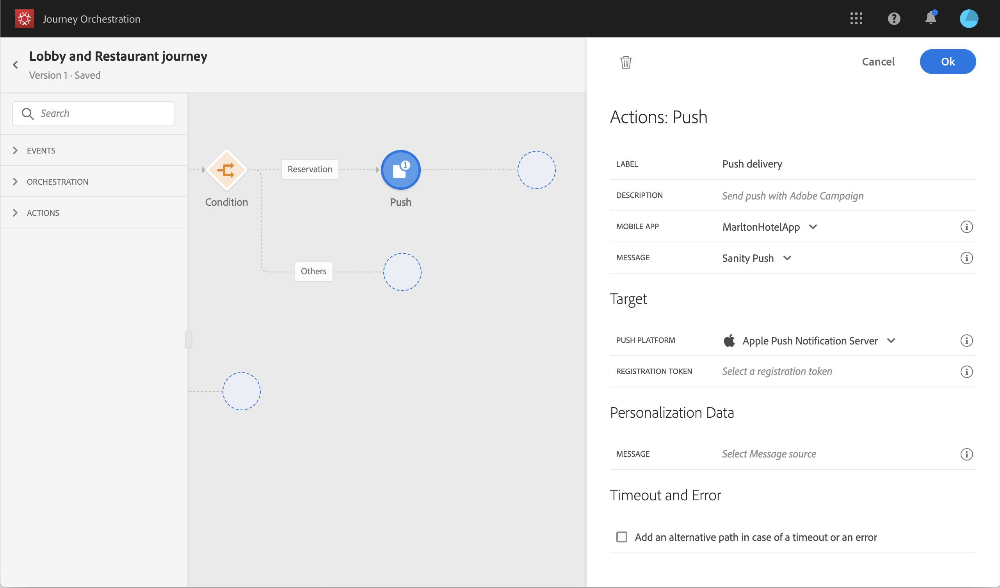

# Bygga resan {#concept_owm_kdy_w2b}

Nu kan **företagsanvändaren** bygga resan. Vår resa omfattar följande aktiviteter:

* två **[!UICONTROL Event]**-aktiviteter: ”LobbyBeacon” och ”RestaurantBeacon”
* två **[!UICONTROL Condition]**-aktiviteter
* tre **[!UICONTROL Push]**-aktiviteter och en **[!UICONTROL Email]**-aktivitet (med Adobe Campaign Standard)
* en **[!UICONTROL Wait]**-aktivitet
* fyra **[!UICONTROL End]**-aktiviteter

>[!NOTE]
>
>Aktiviteterna **[!UICONTROL Push]** och **[!UICONTROL Email]** är bara tillgängliga på paletten om du har Adobe Campaign Standard.

Mer information om hur du bygger en resa finns i [den här sidan](../building-journeys/journey.md).

## Första stegen{#section_ntb_ws1_ffb}

1. Klicka på fliken **[!UICONTROL Home]** och **[!UICONTROL Create]** på den övre menyn för att skapa en ny resa.

   

1. Redigera resans egenskaper i konfigurationsrutan som visas till höger. Lägg till ett namn och ställ in så att det varar i en månad från 1 till 31 december.

   

1. Börja designa din resa genom att dra och släppa händelsen ”LobbyBeacon” från paletten till arbetsytan. Du kan också dubbelklicka på händelsen på paletten och lägga till den på arbetsytan.

   

1. Sedan lägger du till ett villkor för att kontrollera att personen inte har kontaktats under de senaste 24 timmarna och kontrollera om denne är en lojalitetsmedlem. Dra och släpp en villkorlig aktivitet i resan.

   

1. Välj typen **[!UICONTROL Data Source Condition]** och klicka i fältet **[!UICONTROL Expression]**. Du kan även definiera en villkorsetikett som visas på pilen på arbetsytan. I vårt exempel ersätter vi ”Condition 1” med ”Loyalty member”.

   

1. Klicka på **[!UICONTROL Advanced mode]** och definiera följande villkor baserat på fälten ”timestamp” och ”directMarketing.sending.value” som kommer från datakällan i Adobe Experience Platform. Uttryckets syntax är:

   ```
   count(#{ExperiencePlatformDataSource.MarltonExperience.experienceevent.all(
       currentDataPackField.directMarketing.sends.value > 0 and
       currentDataPackField.timestamp > nowWithDelta(-1, "days")).timestamp}) == 0
   and
       #{ExperiencePlatformDataSource.MarltonProfiles.Profile._customer.marlton.loyaltyMember}
   ```

   

1. Klicka på knappen **[!UICONTROL Add a path]** och skapa en andra väg för kunder som inte har kontaktats de senaste 24 timmarna och inte är lojalitetsmedlemmar. Namnge vägen med ”Inte lojalitetsmedlem”. Uttryckets syntax är:

   ```
   count(#{ExperiencePlatformDataSource.MarltonExperience.experienceevent.all(
       currentDataPackField.directMarketing.sends.value > 0 and
       currentDataPackField.timestamp > nowWithDelta(-1, "days").timestamp}) == 0
   and not
       #{ExperiencePlatformDataSource.MarltonProfiles.Profile._customer.marlton.loyaltyMember}
   ```

   >[!NOTE]
   >
   >I den andra delen av uttrycket är ”Profil” valfri.

1. Vi måste välja en namnrymd. En namnrymd är förvald baserat på schemats egenskaper. Du kan behålla den som är förmarkerad. Mer information om namnutrymmen finns i [den här sidan](../event/selecting-the-namespace.md).

I vårt fall vill vi bara reagera på dessa två villkor vilket innebär att vi inte markerar rutan **[!UICONTROL Show path for other cases than the one(s) above]**.

Två vägar skapas efter ditt villkor:

* _Kunder som inte har kontaktats de senaste 24 timmarna och som är lojalitetsmedlemmar._
* _Kunder som inte har kontaktats de senaste 24 timmarna och som inte är lojalitetsmedlemmar._


## Första vägen: kunden är en lojalitetsmedlem {#section_otb_ws1_ffb}

1. Låt oss lägga till ett villkor på den första vägen som kontrollerar om denne har en reservation. Dra och släpp en villkorlig aktivitet i resan.

   

1. Välj typen **[!UICONTROL Data Source Condition]** och definiera villkoret baserat på den statusinformation som finns om reservationen och som har hämtas från reservationssystemet:

   ```
   #{MarltonReservation.MarltonFieldGroup.reservation} == true
   ```

   

1. När du väljer ett fält från en extern datakälla visar den högra delen av skärmen listan med parametrar som definierades när den externa datakällan konfigurerades (se [den här sidan](../usecase/configuring-the-data-sources.md)). Klicka på parameterns namn och definiera värdet för reservationens systemnyckel vilken är Experience Cloud-ID i följande exempel:

   ```
   @{LobbyBeacon.endUserIDs._experience.mcid.id}
   ```

   

1. Eftersom vi även vill reagera på kunder som inte har någon reservation måste vi markera kryssrutan **[!UICONTROL Show path for other cases than the one(s) above]**.

   

   Två vägar skapas:

   * _Kunder som har bokat ett rum_
   * _Kunder som inte har bokat ett rum_

   

1. På den första vägen (ett rum bokat) släpper du en **[!UICONTROL Push]**-aktivitet, väljer din mobila app och mallen ”Welcome”.

   

1. Definiera de **[!UICONTROL Target]**-fält som krävs av systemet för att skicka push-meddelandet.

   * **[!UICONTROL Push platform]**: välj plattformen: **[!UICONTROL Apple Push Notification Server]** (Apple) eller **[!UICONTROL Firebase Cloud Messaging]** (Android).
   * **[!UICONTROL Registration token]**: lägg till följande uttryck (baserat på den konfigurerade händelsen) med hjälp av det avancerade läget:

      ```
      @{LobbyBeacon._experience.campaign.message.profileSnapshot.pushNotificationTokens.first().token}
      ```

1. Definiera personaliseringsfälten för push-meddelandet. I vårt exempel: förnamn och efternamn.

1. Lägg till händelsen ”RestaurantBeacon”.

   

1. Lägg till en ny **[!UICONTROL Push]**-aktivitet, välj mallen ”Meal discount” och definiera fälten **[!UICONTROL Address]** och **[!UICONTROL Personalization]**. Lägg till en **[!UICONTROL End]**-aktivitet.  

   

1. Vi vill endast skicka ett push-meddelande om en måltidsrabatt om personen kommer in i restaurangen inom sex timmar efter push-meddelandet med välkomnandet. För att göra detta måste vi använda en vänteaktivitet. Placera markören på push-aktiviteten och klicka på plussymbolen ”+”. Lägg till en vänteaktivitet i den nya vägen och definiera en varaktighet på sex timmar. Den första berättigade aktiviteten väljs. Om restauranghändelsen tas emot mindre än sex timmar efter push-meddelandet med välkomnandet skickas push-aktiviteten. Om ingen restauranghändelse tas emot inom de kommande sex timmarna väljs väntetiden. Placera en **[!UICONTROL End]**-aktivitet efter vänteaktiviteten.

   

1. På den andra vägen som följer reservationsvillkoret (inget rum bokat) lägger du till en **[!UICONTROL Push]**-aktivitet och väljer mallen ”Room rates”. Lägg till en **[!UICONTROL End]**-aktivitet.  

   

## Andra vägen: kunden är inte en lojalitetsmedlem{#section_ptb_ws1_ffb}

1. På den andra vägen som följer det första villkoret (kunden är inte en lojalitetsmedlem) lägger du till en **[!UICONTROL Email]**-aktivitet och väljer mallen ”Loyalty membership”.

   

1. I fältet **[!UICONTROL Address]** väljer du e-postadressen från datakällan.

   

1. Definiera personaliseringsfälten med för- och efternamn från datakällan.

   

1. Lägg till en **[!UICONTROL End]**-aktivitet.  

Klicka på växlingsknappen **[!UICONTROL Test]** och testa din resa. Om något fel uppstår kan du inaktivera testläget, ändra din resa och testa den igen. Mer information om testläget finns i [den här sidan](../building-journeys/testing-the-journey.md).


När testet är klart kan du publicera din resa från den övre högra rullgardinsmenyn.


