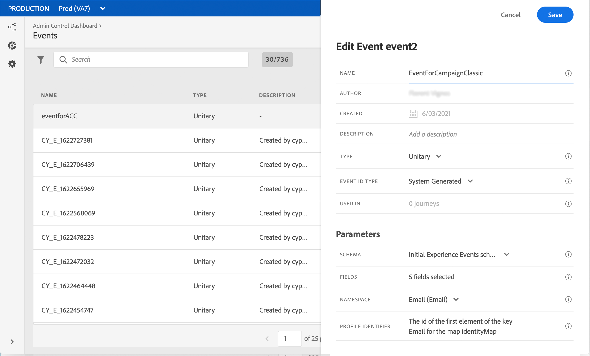
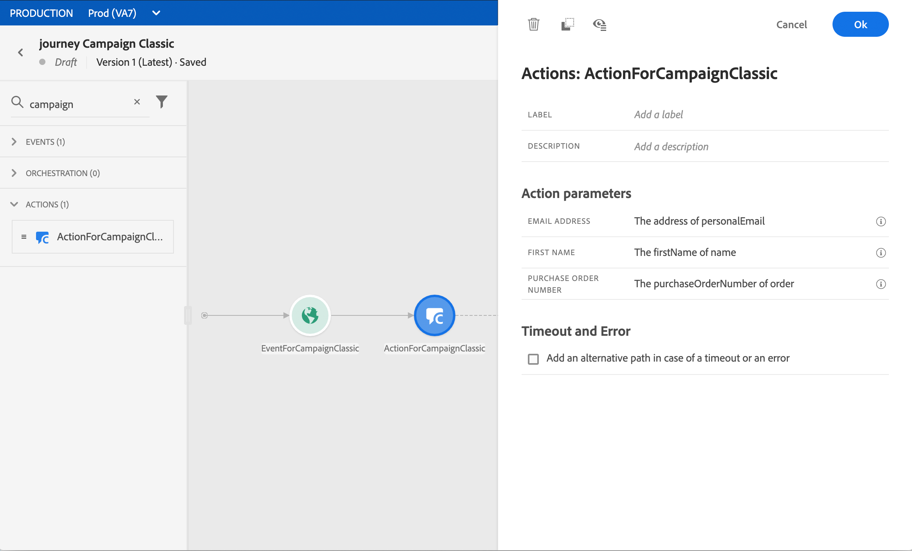

# Skicka ett meddelande med Campaign v7/v8 {#campaign-classic-use-case}


>[!CAUTION]
>
>**Söker du Adobe Journey Optimizer**? Klicka [här](https://experienceleague.adobe.com/sv/docs/journey-optimizer/using/ajo-home){target="_blank"} för Journey Optimizer-dokumentation.
>
>
>_Den här dokumentationen hänvisar till äldre Journey Orchestration-material som har ersatts av Journey Optimizer. Kontakta ditt kontoteam om du har frågor om din åtkomst till Journey Orchestration eller Journey Optimizer._


I det här exemplet presenteras alla steg som krävs för att skicka e-post med hjälp av integreringen med Adobe Campaign Classic v7 och Adobe Campaign v8.

Vi skapar först en transaktionell e-postmall i Campaign. I Journey Orchestration skapar vi sedan evenemanget, handlingen och designen av kundresan.

Mer information om Campaign-integrationen finns på följande sidor:

* [Skapa en kampanjåtgärd](../action/acc-action.md)
* [Använda åtgärden i en resa](../building-journeys/using-adobe-campaign-classic.md).

**Adobe Campaign**

Din Campaign-instans måste etableras för den här integreringen. Funktionen för transaktionsmeddelanden måste konfigureras.

1. Logga in på din Campaign-kontrollinstans.

1. Välj uppräkningen **Event type** (eventType) under **Administration** > **Platform** > **Enumerations**. Skapa en ny händelsetyp (&quot;travel-event&quot;, i vårt exempel). Du måste använda det interna namnet för händelsetypen när du skriver JSON-filen senare.

   

1. Koppla från och återanslut till instansen för att skapa.

1. Skapa en ny e-postmall baserad på den händelsetyp som skapats tidigare under **Meddelandecenter** > **Mallar för transaktionsmeddelanden**.

   

1. Designa din mall. I det här exemplet använder vi personalisering på profilens förnamn och ordernummer. Förnamnet finns i Adobe Experience Platform datakälla och ordernumret är ett fält från vår Journey Orchestration-händelse. Se till att du använder rätt fältnamn i Campaign.

   

1. Publicera din transaktionsmall.

   

1. Nu måste du skriva JSON-nyttolasten som motsvarar mallen.

```
{
     "channel": "email",
     "eventType": "journey-event",
     "email": "Email address",
     "ctx": {
          "firstName": "First name", "purchaseOrderNumber": "Purchase order number"
     }
}
```

* För kanalen måste du skriva&quot;email&quot;.
* Använd det interna namnet för händelsetypen som skapades tidigare för eventType.
* E-postadressen blir en variabel, så du kan skriva vilken etikett som helst.
* I ctx är även personaliseringsfälten variabler.

**Journey Orchestration**

1. Först måste du skapa en händelse. Se till att du inkluderar fältet&quot;purchaseOrderNumber&quot;.

   

1. Sedan måste ni i Journey Orchestration skapa en åtgärd som motsvarar er Campaign-mall. I listrutan **Åtgärdstyp** väljer du **Adobe Campaign Classic**.

   

1. Klicka på **Nyttolastfältet** och klistra in den JSON som skapades tidigare.

   

1. Ändra **Konstant** till **Variabel** för e-postadressen och de två anpassningsfälten.

   

1. Skapa nu en ny resa och börja med det event som skapats tidigare.

   

1. Lägg till åtgärden och mappa varje fält till rätt fält i Journey Orchestration.

   

1. Lägg till en **End**-aktivitet och testa din resa.

   

1. Nu kan du publicera din resa.
