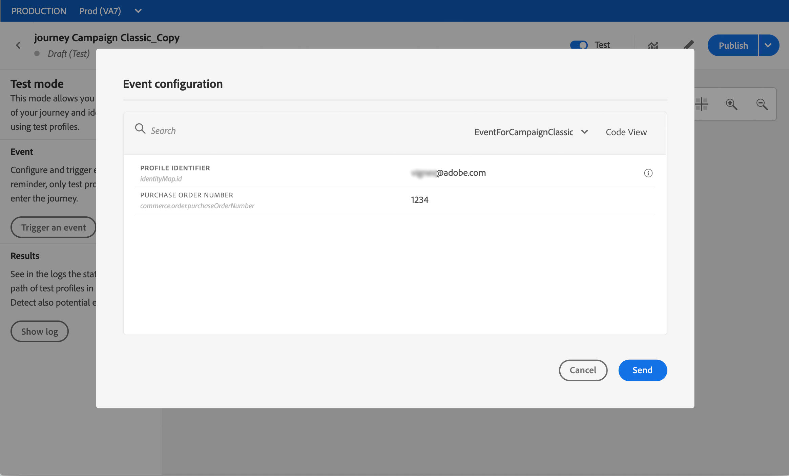

# Skicka ett meddelande med Campaign {#campaign-v7-v8-use-case}

I det här exemplet beskrivs alla steg som krävs för att skicka e-post med hjälp av Adobe Campaign-integreringen.

Vi skapar först en transaktionell e-postmall i Campaign. I Journey Orchestration ska vi sedan skapa evenemanget, handlingen och utforma resan.

Mer information om Campaign-integrationen finns på följande sidor:

* [Skapa en Campaign-åtgärd](../action/working-with-adobe-campaign.md#using_adobe_campaign_v7_v8)
* [Använda åtgärden på en resa](../building-journeys/using-adobe-campaign-actions.md).

**Adobe Campaign**

Din Campaign-instans måste etableras för den här integreringen. Funktionen för transaktionsmeddelanden måste konfigureras.

1. Logga in på din Campaign-kontrollinstans.

1. Under **Administration** > **Plattform** > **Uppräkningar** väljer du uppräkningen **Händelsetyp** (eventType). Skapa en ny händelsetyp (&quot;travel-event&quot;, i vårt exempel). Du måste använda det interna namnet för händelsetypen när du skriver JSON-filen senare.

   

1. Koppla från och återanslut till instansen för att skapa.

1. Under **Message Center** > **Transactional message templates** skapar du en ny e-postmall baserad på den händelsetyp som skapats tidigare.

   

1. Designa din mall. I det här exemplet använder vi personalisering på profilens förnamn och ordernummer. Förnamnet finns i Adobe Experience Platform datakälla och ordernumret är ett fält från händelsen Journey Orchestration. Se till att du använder rätt fältnamn i Campaign.

   

1. Publicera din transaktionsmall.

   

1. Nu måste du skriva JSON-nyttolasten som motsvarar mallen.

```
{
     "channel": "email",
     "eventType": "journey-event",
     "email": "Email address",
     "ctx": {
          "firstName": "First name", "purchaseOrderNumber": "Purchase order number"
     }
}
```

* För kanalen måste du skriva&quot;email&quot;.
* Använd det interna namnet för händelsetypen som skapades tidigare för eventType.
* E-postadressen blir en variabel, så du kan skriva vilken etikett som helst.
* I ctx är även personaliseringsfälten variabler.

**Journey Orchestration**

1. Först måste du skapa en händelse. Se till att du inkluderar fältet&quot;purchaseOrderNumber&quot;.

   

1. Sedan måste ni i Journey Orchestration skapa en åtgärd som motsvarar er Campaign-mall. I listrutan **Åtgärdstyp** väljer du **Adobe Campaign Classic**.

   

1. Klicka på **Nyttolastfältet** och klistra in den JSON som skapades tidigare.

   

1. För e-postadressen och de två anpassningsfälten ändrar du **Konstant** till **Variabel**.

   

1. Skapa nu en ny resa och börja med det event som skapats tidigare.

   

1. Lägg till åtgärden och mappa varje fält till rätt fält i Journey Orchestration.

   

1. Lägg till en **End**-aktivitet och testa din resa.

   

1. Nu kan du publicera din resa.
