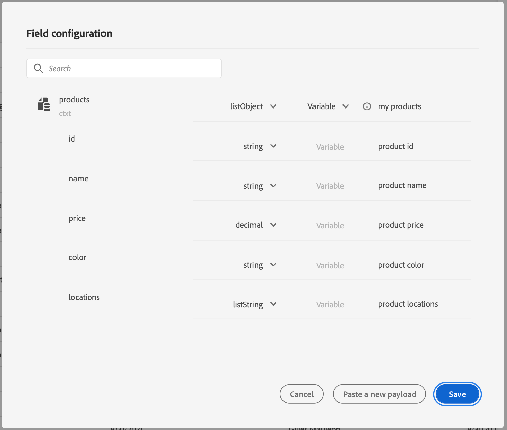

# Skicka samlingar dynamiskt med anpassade åtgärder{#passing-collection}


>[!CAUTION]
>
>**Söker du Adobe Journey Optimizer**? Klicka [här](https://experienceleague.adobe.com/sv/docs/journey-optimizer/using/ajo-home){target="_blank"} för Journey Optimizer-dokumentation.
>
>
>_Den här dokumentationen hänvisar till äldre Journey Orchestration-material som har ersatts av Journey Optimizer. Kontakta ditt kontoteam om du har frågor om din åtkomst till Journey Orchestration eller Journey Optimizer._


Du kan skicka en samling i anpassade åtgärdsparametrar som fylls i dynamiskt vid körning. Två sorters samlingar stöds:

* enkla samlingar: arrayer med enkla datatyper, till exempel med en listString:

  ```
  {
   "deviceTypes": [
       "android",
       "ios"
   ]
  }
  ```

* objektsamlingar: en array med JSON-objekt, till exempel:

  ```
  {
  "products":[
     {
        "id":"productA",
        "name":"A",
        "price":20.1
     },
     {
        "id":"productB",
        "name":"B",
        "price":10.0
     },
     {
        "id":"productC",
        "name":"C",
        "price":5.99
     }
   ]
  }
  ```

## Begränsningar {#limitations}

* Kapslade arrayer med objekt i en objektarray stöds inte för närvarande. Exempel:

  ```
  {
  "products":[
    {
       "id":"productA",
       "name":"A",
       "price":20,
       "locations": [{"name": "Paris"}, {"name": "London"}]
    },
   ]
  }
  ```

* Om du vill testa samlingar i testläge måste du använda kodvisningsläget. Kodvyn stöds för närvarande inte för affärshändelser. Du kan bara skicka en samling med ett enda element.

## Allmänt förfarande {#general-procedure}

I det här avsnittet använder vi följande JSON-exempel på nyttolast. Det här är en array med objekt med ett fält som är en enkel samling.

```
{
  "ctxt": {
    "products": [
      {
        "id": "productA",
        "name": "A",
        "price": 20.1,
        "color":"blue",
        "locations": [
          "Paris",
          "London"
        ]
      },
      {
        "id": "productB",
        "name": "B",
        "price": 10.99
      }
    ]
  }
}
```

Du ser att&quot;products&quot; är en array med två objekt. Du måste ha minst ett objekt.

1. Skapa en anpassad åtgärd. Läs [den här sidan](../action/about-custom-action-configuration.md).

1. Klistra in JSON-exemplet i avsnittet **[!UICONTROL Action parameters]**. Den visade strukturen är statisk: när du klistrar in nyttolasten definieras alla fält som konstanter.

   

1. Justera fälttyperna om det behövs. Följande fälttyper stöds för samlingar: listString, listInteger, listDecimal, listBoolean, listDateTime, listDateTimeOnly, listDateOnly, listObject

   >[!NOTE]
   >
   >Fälttypen härleds automatiskt enligt exempel på nyttolast.

1. Om du vill skicka objekt dynamiskt måste du ange dem som variabler. I det här exemplet anger vi&quot;products&quot; som variable. Alla objektfält i objektet ställs in automatiskt på variabler.

   >[!NOTE]
   >
   >Det första objektet i nyttolastexemplet används för att definiera fälten.

1. Definiera den etikett som ska visas på arbetsytan för varje fält.

   

1. Skapa din resa och lägg till den anpassade åtgärd du skapade. Läs [den här sidan](../building-journeys/using-custom-actions.md).

1. I avsnittet **[!UICONTROL Action parameters]** definierar du arrayparametern (&quot;products&quot; in our example) med den avancerade uttrycksredigeraren.

   

1. För vart och ett av följande objektfält anger du motsvarande fältnamn från XDM-källschemat. Om namnen är identiska behövs inte detta. I vårt exempel behöver vi bara definiera&quot;produkt-id&quot; och&quot;färg&quot;.

   

För arrayfältet kan du även använda den avancerade uttrycksredigeraren för att utföra datamanipulering. I följande exempel använder vi funktionerna [filter](../functions/functionfilter.md) och [intersect](../functions/functionintersect.md):


## Särskilda fall{#examples}

För heterogena typer och arrayer av arrayer definieras arrayen med typen listAny. Du kan bara mappa enskilda objekt, men inte ändra arrayen till variabel.


Exempel på heterogen typ:

```
{
    "data_mixed-types": [
        "test",
        "test2",
        null,
        0
    ]
}
```

Exempel på array med arrayer:

```
{
    "data_multiple-arrays": [
        [
            "test",
            "test1",
            "test2"
        ]
    ]
}
```

**Relaterade ämnen**

[Använd anpassade åtgärder](../building-journeys/using-custom-actions.md)
