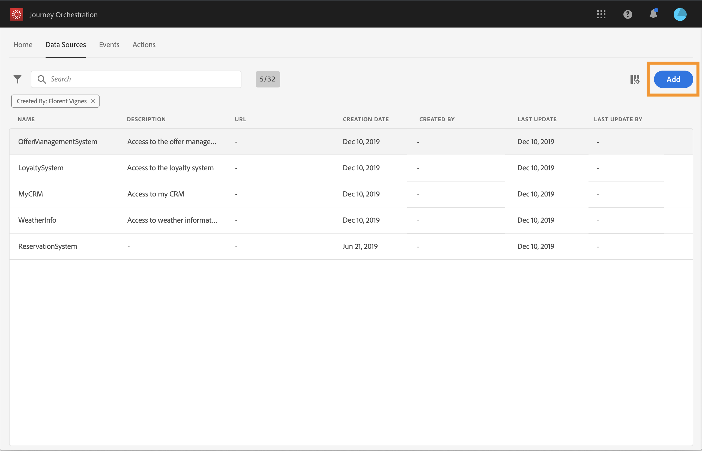

# Konfigurera datakällorna {#concept_vml_hdy_w2b}

I vårt fall vill vi använda personaliseringsdata för våra meddelanden. Vi måste också kontrollera om personen är en lojalitetsmedlem och inte har kontaktats under de senaste 24 timmarna. Den här informationen lagras i kundprofildatabasen i realtid. Den **tekniska användaren** måste konfigurera Adobe Experience Platform datakälla för att hämta fälten.

Mer information om konfiguration av datakälla finns på [den här sidan](../datasource/about-data-sources.md).

1. Klicka på fliken på den övre menyn och välj den inbyggda Adobe Experience Platform-datakällan **[!UICONTROL Data Sources]** .

   

1. Kontrollera att följande fält är markerade i de förkonfigurerade gruppfälten:

   * _person > namn > firstName_
   * _person > namn > efternamn_
   * _personalEmail > address_

1. Klicka **[!UICONTROL Add a New Field Group]**, välj ett **[!UICONTROL Profiles]** schema och lägg till fältet **Loyalty-medlem** för vårt villkor. Fältet **Loyalty-medlem** är ett anpassat fält och lades till i XDM: &quot;_customer > marlton > loyaltyMember&quot;

   

1. Klicka **[!UICONTROL Add a New Field Group]** och markera ett **[!UICONTROL ExperienceEvent]** schema och välj de fält som behövs för villkoret för antalet meddelanden som skickas under en viss period: _tidsstämpel_ för datumet och _directMarketing > Skickar > värde_ för antalet skickade meddelanden.

   

1. Klicka på **[!UICONTROL Save]**.

Vi måste också kontrollera om personen har en bokning i hotellbokningen. Den **tekniska användaren** måste konfigurera en andra datakälla för att hämta det här fältet.

1. I listan med datakällor klickar du för **[!UICONTROL Add]** att lägga till en ny extern datakälla för att definiera anslutningen till ditt bokningssystem.

   

1. Ange ett namn för datakällan och URL:en för den externa tjänsten, till exempel: _https://marlton.com/reservation_

   >[!CAUTION]
   >
   >Vi rekommenderar starkt att HTTPS används av säkerhetsskäl.

1. Konfigurera autentiseringen beroende på den externa tjänstens konfiguration: **[!UICONTROL No authentication]**, **[!UICONTROL Basic]**, **[!UICONTROL Custom]** eller **[!UICONTROL API key]**. I vårt exempel väljer vi&quot;Grundläggande&quot; som typ och anger användarnamn och lösenord för API-anropet.

   

1. Klicka **[!UICONTROL Add a New Field Group]** för att definiera informationen som ska hämtas och API-parametrarna. Det finns till exempel bara en parameter (id), så vi måste skapa en fältgrupp med följande information:

   * **[!UICONTROL Method]**: välj metoden POST eller GET. I vårt fall väljer vi metoden GET.
   * **[!UICONTROL Cache duration]**: detta varierar beroende på hur ofta API-anrop görs. I vårt fall uppdateras reservationssystemet var 10:e minut.
   * **[!UICONTROL Response Payload]**: klicka inuti **[!UICONTROL Payload]** fältet och klistra in ett exempel på nyttolasten. Kontrollera att fälttyperna är korrekta. Varje gång API:et anropas hämtas alla fält som ingår i exemplets nyttolast. I vårt exempel innehåller nyttolasten bara reservationsstatusen:

   ```
   {
       "reservation" : true
   }
   ```

   * **[!UICONTROL Dynamic Values]**: Ange parametern som motsvarar nyckeln som används för att identifiera varje kund,&quot;id&quot; i vårt exempel. Värdet för den här parametern definieras i resan.

   

1. Klicka på **[!UICONTROL Save]**.

   Datakällorna är nu konfigurerade och klara att användas under din resa.
