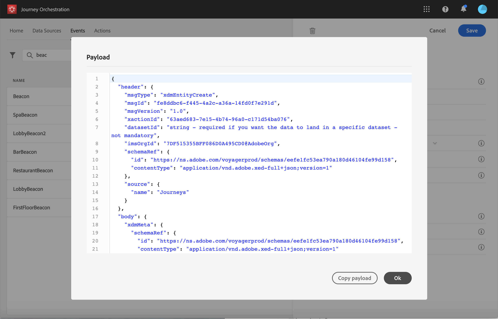

# Konfigurera händelserna {#concept_sbp_5cy_w2b}

I vårt scenario måste vi få ett event varje gång en person kommer in på Marlton-hotellet och restaurangen. The **teknisk användare** måste konfigurera de två händelser som vi vill att systemet ska lyssna på under vår resa.

Mer information om händelsekonfiguration finns i [den här sidan](../event/about-events.md).

1. Klicka på **[!UICONTROL Events]** och klicka **[!UICONTROL Add]** för att skapa en ny händelse.

   

1. Vi anger namnet utan mellanslag eller specialtecken: &quot;LobbyBeacon&quot;.

   

1. Vi väljer sedan schemat och definierar den nyttolast som förväntas för den här händelsen. Vi väljer de fält som behövs i den normaliserade XDM-modellen. Vi behöver Experience Cloud-ID:t för att kunna identifiera personen i kundprofildatabasen i realtid: &quot;endUserIDs > _experience > mcid > id&quot;.

   Vi behöver också en registreringstoken för att skicka push-meddelanden: &quot;_experience > campaign > message > profile > pushNotificationTokens > token&quot;

   Ett ID genereras automatiskt för den här händelsen. Detta ID lagras i **[!UICONTROL eventID]** fält (&quot;_experience > campaign > orchestration > eventID&quot;). Det system som skickar händelsen ska inte generera ett ID, det ska använda det som finns i nyttolastförhandsvisningen. I det här fallet används det här ID:t för att identifiera var beacon finns. Varje gång en person går nära lobbybeacon skickas en händelse som innehåller detta specifika händelse-ID. Samma princip gäller för restaurangfynden. På så sätt kan systemet veta vilken signal som utlöste den skickade händelsen.

   

   >[!NOTE]
   >
   >Listan med fält varierar mellan olika scheman. Enligt schemadefinitionen kan vissa fält vara obligatoriska och förmarkerade.

1. Vi måste välja en namnrymd. En namnrymd är förvald baserat på schemats egenskaper. Du kan behålla den som är förmarkerad. Mer information om namnutrymmen finns i [den här sidan](../event/selecting-the-namespace.md).

   

1. En tangent är förvald baserat på schemaegenskaper och det namnområde som har valts. Du kan behålla den.

   

1. Klicka på **[!UICONTROL Save]**.

1. Klicka på **[!UICONTROL View Payload]** -ikonen för att förhandsgranska nyttolasten som förväntas av systemet och dela den med den person som är ansvarig för händelsen som skickas.  Den här nyttolasten måste konfigureras i bakåtgången av administrationskonsolen för Mobile Services.

   

På samma sätt skapar du händelsen&quot;RestaurantBeacon&quot;. Dina två beacon-händelser skapas och kan nu användas under vår resa. Nu måste du konfigurera mobilprogrammet så att det kan skicka den förväntade nyttolasten till API:ernas slutpunkt för direktuppspelningsinmatning. Läs [den här sidan](../event/additional-steps-to-send-events-to-journey-orchestration.md).
